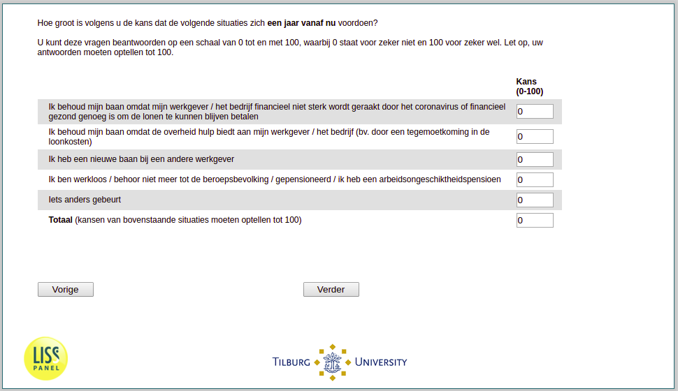

.. _w3e-q26header_1:

 
 .. role:: raw-html(raw) 
        :format: html 

`q26header_1` – Expectations Next Year among Employed
=====================================================

:raw-html:`&larr;` :ref:`w3e-q26header` | :ref:`w3e-Q26header_1` :raw-html:`&rarr;` 

*Routing to the question depends on answer in:* :ref:`w3e-EmploymentStatus`

In your opinion, what are the chances of the following situations occurring a year from now? You can answer these questions on a scale from 0 to 100, where 0 stands for definitely not and 100 for definitely yes. Please note that your answers must add up to 100.

.. csv-table::
   :delim: |

           I keep my job because my employer / company is not financially affected by the coronavirus or is financially healthy enough to continue to pay wages | :raw-html:`<form><input type="text" id="fname" name="fname"> </form>`
           I keep my job because the government offers help to my employer / company (e.g. through an allowance for labour costs). | :raw-html:`<form><input type="text" id="fname" name="fname"> </form>`
           I have a new job with another employer | :raw-html:`<form><input type="text" id="fname" name="fname"> </form>`

:raw-html:`&larr;` :ref:`w3e-q26header` | :ref:`w3e-Q26header_1` :raw-html:`&rarr;` 

