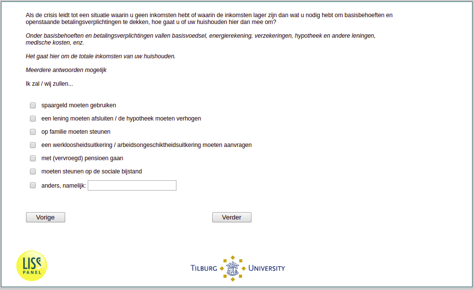

.. _w3e-q29: 

 
 .. role:: raw-html(raw) 
        :format: html 
 
`q29` – Economic Coping Strategies
======================================== 

:raw-html:`&larr;` :ref:`w3e-q28` | :ref:`w3e-q31` :raw-html:`&rarr;` 
 

If the crisis leads to a situation where you have no income or where the income is lower than what you need to cover basic needs and outstanding payment obligations, how do you or your household deal with this? 

Basic needs and commitments include basic food, energy bills, insurance, mortgages and other loans, medical expenses, etc.

This is your household's total income. 

Multiple answers possible 
 
:raw-html:`&#10063;` – have to use savings
 
:raw-html:`&#10063;` – have to take out a loan / increase the mortgage
 
:raw-html:`&#10063;` – rely on family
 
:raw-html:`&#10063;` – apply for unemployment benefit / incapacity benefit
 
:raw-html:`&#10063;` – retire (early)
 
:raw-html:`&#10063;` – have to rely on social assistance
 
:raw-html:`&#10063;` – otherwise, that is:
 

:raw-html:`&larr;` :ref:`w3e-q28` | :ref:`w3e-q31` :raw-html:`&rarr;` 
 
