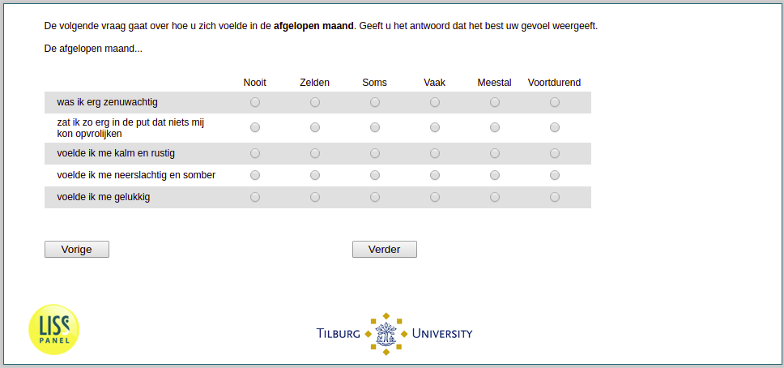

.. _w3e-q30hd_maand: 

 
 .. role:: raw-html(raw) 
        :format: html 
 
`q30hd_maand` – Mental Health in the Past Month
============================================================= 

:raw-html:`&larr;` :ref:`w3e-q30` | :ref:`w3e-SAH` :raw-html:`&rarr;` 
 

The next question is about how you've felt over the past month. Give you the answer that best reflects your feelings.  For the past month...
 
.. csv-table:: 
   :delim: | 
   :header: ,Never, Rarely, Sometimes, Often, Usually, Constantly
 
           I felt very anxious | :raw-html:`&#10063;`|:raw-html:`&#10063;`|:raw-html:`&#10063;`|:raw-html:`&#10063;`|:raw-html:`&#10063;`|:raw-html:`&#10063;` 
           I felt so down that nothing could cheer me up | :raw-html:`&#10063;`|:raw-html:`&#10063;`|:raw-html:`&#10063;`|:raw-html:`&#10063;`|:raw-html:`&#10063;`|:raw-html:`&#10063;` 
           I felt calm and peaceful | :raw-html:`&#10063;`|:raw-html:`&#10063;`|:raw-html:`&#10063;`|:raw-html:`&#10063;`|:raw-html:`&#10063;`|:raw-html:`&#10063;` 
           I felt depressed and gloomy | :raw-html:`&#10063;`|:raw-html:`&#10063;`|:raw-html:`&#10063;`|:raw-html:`&#10063;`|:raw-html:`&#10063;`|:raw-html:`&#10063;` 
           I felt happy | :raw-html:`&#10063;`|:raw-html:`&#10063;`|:raw-html:`&#10063;`|:raw-html:`&#10063;`|:raw-html:`&#10063;`|:raw-html:`&#10063;` 

:raw-html:`&larr;` :ref:`w3e-q30` | :ref:`w3e-SAH` :raw-html:`&rarr;` 
 
