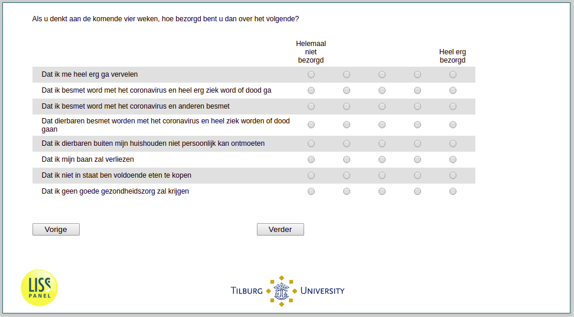

.. _w3e-q31header:

 
 .. role:: raw-html(raw) 
        :format: html 

`q31header` – Concerns
======================

:raw-html:`←` :ref:`w3e-q29` | :ref:`w3e-q33header` :raw-html:`→` 

If you're thinking about the next four weeks, how worried are you?

.. csv-table::
   :delim: |
   :header: ,Not worried at all, , , , Very worried

           That I get very bored | :raw-html:`❏`|:raw-html:`❏`|:raw-html:`❏`|:raw-html:`❏`|:raw-html:`❏`
           That I become infected with the coronavirus and become very ill or die | :raw-html:`❏`|:raw-html:`❏`|:raw-html:`❏`|:raw-html:`❏`|:raw-html:`❏`
           That I get infected with the coronavirus and infect others | :raw-html:`❏`|:raw-html:`❏`|:raw-html:`❏`|:raw-html:`❏`|:raw-html:`❏`
           That loved ones become infected with the coronavirus and become very ill or die | :raw-html:`❏`|:raw-html:`❏`|:raw-html:`❏`|:raw-html:`❏`|:raw-html:`❏`
           That I can't meet loved ones outside my household in person | :raw-html:`❏`|:raw-html:`❏`|:raw-html:`❏`|:raw-html:`❏`|:raw-html:`❏`
           That I will lose my job | :raw-html:`❏`|:raw-html:`❏`|:raw-html:`❏`|:raw-html:`❏`|:raw-html:`❏`
           That I am unable to buy enough food | :raw-html:`❏`|:raw-html:`❏`|:raw-html:`❏`|:raw-html:`❏`|:raw-html:`❏`
           That I will not get good health care | :raw-html:`❏`|:raw-html:`❏`|:raw-html:`❏`|:raw-html:`❏`|:raw-html:`❏`

:raw-html:`←` :ref:`w3e-q29` | :ref:`w3e-q33header` :raw-html:`→` 

