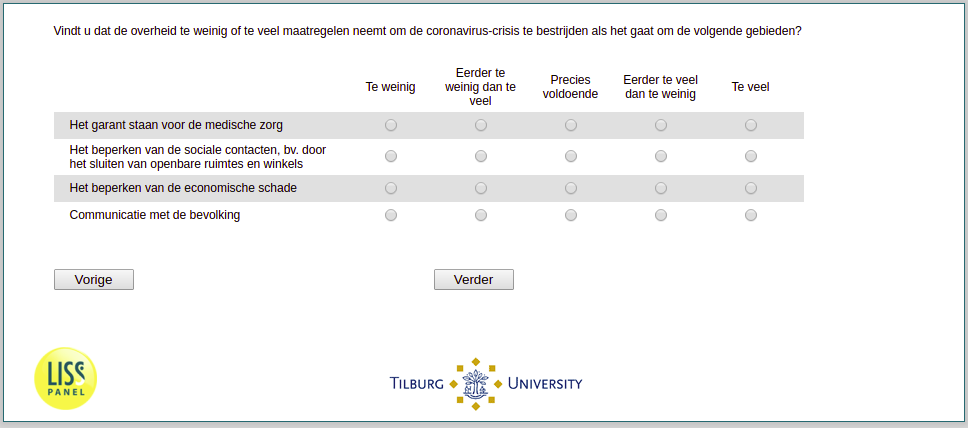

.. _w3e-q33: 

 
 .. role:: raw-html(raw) 
        :format: html 
 
`q33` – Government Action
=============================== 

:raw-html:`←` :ref:`w3e-q31` | :ref:`w3e-v0` :raw-html:`→` 
 

Do you think that the government is taking too few or too many measures to combat the coronavirus crisis in the following areas?
 
.. csv-table:: 
   :delim: | 
   :header: ,Too little, Rather too little than too much, Exactly sufficient, Rather too much than too little, Too much
 
           Guaranteeing medical care | :raw-html:`❏`|:raw-html:`❏`|:raw-html:`❏`|:raw-html:`❏`|:raw-html:`❏` 
           Limiting social contacts, e.g. by closing public spaces and shops | :raw-html:`❏`|:raw-html:`❏`|:raw-html:`❏`|:raw-html:`❏`|:raw-html:`❏` 
           Reducing economic damage | :raw-html:`❏`|:raw-html:`❏`|:raw-html:`❏`|:raw-html:`❏`|:raw-html:`❏` 
           Communication with the population | :raw-html:`❏`|:raw-html:`❏`|:raw-html:`❏`|:raw-html:`❏`|:raw-html:`❏` 

:raw-html:`←` :ref:`w3e-q31` | :ref:`w3e-v0` :raw-html:`→` 
 
