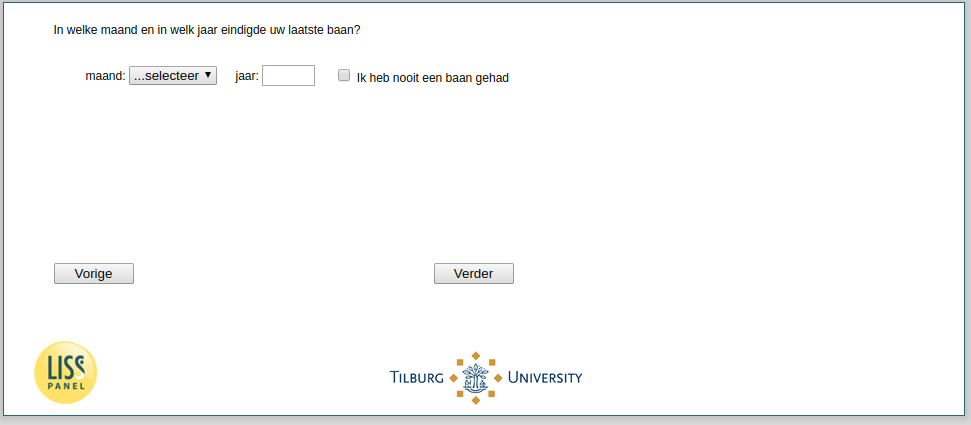

.. _w3e-q4_header:

 
 .. role:: raw-html(raw) 
        :format: html 

`q4_header` – Last Job End
==========================

:raw-html:`←` :ref:`w3e-q2` | :ref:`w3e-distance` :raw-html:`→` 

*Routing to the question depends on answer in:* :ref:`w3e-EmploymentStatus`

In which month and in which year did your last job end?

.. csv-table::
   :delim: |

           Year | :raw-html:`<form><input type="text" id="fname" name="fname"> </form>`
           Month | :raw-html:`<form><input type="text" id="fname" name="fname"> </form>`

:raw-html:`&larr;` :ref:`w3e-q2` | :ref:`w3e-distance` :raw-html:`&rarr;` 

