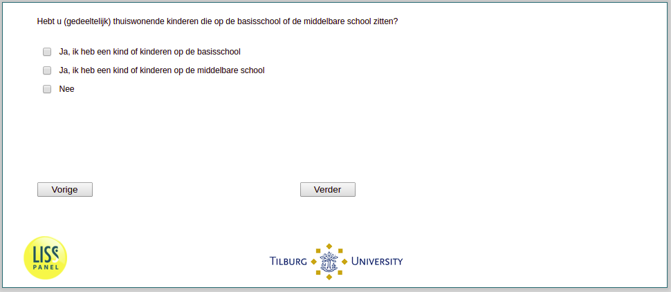

.. _w3e-v0: 

 
 .. role:: raw-html(raw) 
        :format: html 
 
`v0` – School Aged Children in Household
============================================= 

:raw-html:`&larr;` :ref:`w3e-q33` | :ref:`w3e-v0a` :raw-html:`&rarr;` 
 

Do you have (partially) home-housed children who are in primary or secondary school?
 
.. csv-table:: 
   :delim: | 
   :header: Yes I have a child or children in elementary school, Yes I have a child or children in high school, No
 
           :raw-html:`&#10063;`|:raw-html:`&#10063;`|:raw-html:`&#10063;` 

:raw-html:`&larr;` :ref:`w3e-q33` | :ref:`w3e-v0a` :raw-html:`&rarr;` 
 
