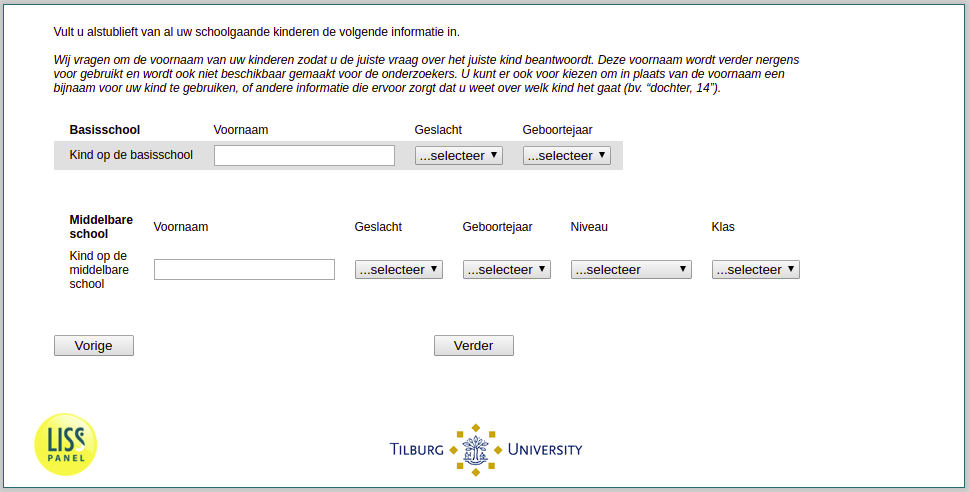

.. _w3e-v1_bo: 

 
 .. role:: raw-html(raw) 
        :format: html 
 
`v1_bo` – Information Children Primary 
=============================================== 

:raw-html:`&larr;` :ref:`w3e-v0b` | :ref:`w3e-v1_vo` :raw-html:`&rarr;` 
 
*Routing to the question depends on answer in:* :ref:`w3e-v0` 

We ask for the first name of your children so that you answer the right question about the right child. This first name will not be used for anything else, nor will it be made available to the researchers. You can also choose to use a nickname for your child instead of the first name, or other information that ensures that you know which child it concerns (e.g. "daughter, 14").
 
.. csv-table:: 
   :delim: | 
   :header: ,name, gender, birthyear
 
           First child in primary school | :raw-html:`<form><input type="text" id="fname" name="fname"> </form>` |:raw-html:`<form><input type="text" id="fname" name="fname"> </form>` |:raw-html:`<form><input type="text" id="fname" name="fname"> </form>` 
           Second child in primary school | :raw-html:`<form><input type="text" id="fname" name="fname"> </form>` |:raw-html:`<form><input type="text" id="fname" name="fname"> </form>` |:raw-html:`<form><input type="text" id="fname" name="fname"> </form>` 
           Third child in primary school | :raw-html:`<form><input type="text" id="fname" name="fname"> </form>` |:raw-html:`<form><input type="text" id="fname" name="fname"> </form>` |:raw-html:`<form><input type="text" id="fname" name="fname"> </form>` 
           Fourth child in primary school | :raw-html:`<form><input type="text" id="fname" name="fname"> </form>` |:raw-html:`<form><input type="text" id="fname" name="fname"> </form>` |:raw-html:`<form><input type="text" id="fname" name="fname"> </form>` 
           Fifth child in primary school | :raw-html:`<form><input type="text" id="fname" name="fname"> </form>` |:raw-html:`<form><input type="text" id="fname" name="fname"> </form>` |:raw-html:`<form><input type="text" id="fname" name="fname"> </form>` 

:raw-html:`&larr;` :ref:`w3e-v0b` | :ref:`w3e-v1_vo` :raw-html:`&rarr;` 
 
