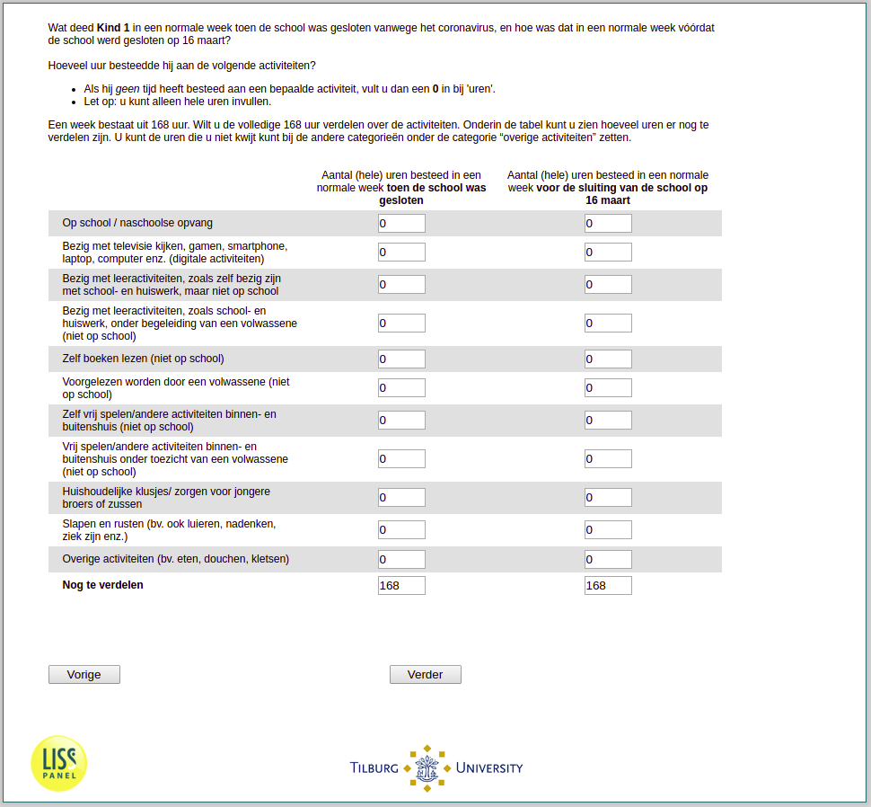

.. _w3e-v2_bokind: 

 
 .. role:: raw-html(raw) 
        :format: html 
 
`v2_bokind` – Weekly Time Spent Children
==================================================== 

:raw-html:`&larr;` :ref:`w3e-v1_vo` | :ref:`w3e-v3_bokind` :raw-html:`&rarr;` 
 
*Routing to the question depends on answer in:* :ref:`w3e-v0` 

What did the child do in a normal week when the school was closed because of the coronavirus, and what was it like in a normal week before the school closed on March 16?

How many hours did the child spend on the following activities?
• If the child has not spent time on a certain activity, enter a 0 in 'hours'.
• Note: you can only fill in whole hours.
A week consists of 168 hours. Do you want to divide the entire 168 hours between the activities. At the bottom of the table you can see how many hours can still be divided. You can put the hours you cannot spend under the category “other activities” in the other categories.
 
.. csv-table:: 
   :delim: | 
   :header: ,Number of (whole) hours spent in a normal week when the school was closed, Number of (whole) hours spent in a normal week before the school was closed on March 16
 
           At school / after-school care | :raw-html:`<form><input type="text" id="fname" name="fname"> </form>` |:raw-html:`<form><input type="text" id="fname" name="fname"> </form>` 
           Watching television, gaming, smartphone, laptop, computer, etc. (digital activities) | :raw-html:`<form><input type="text" id="fname" name="fname"> </form>` |:raw-html:`<form><input type="text" id="fname" name="fname"> </form>` 
           Engaged in learning activities, such as doing school and homework, but not at school | :raw-html:`<form><input type="text" id="fname" name="fname"> </form>` |:raw-html:`<form><input type="text" id="fname" name="fname"> </form>` 
           earning activities, such as school and homework, accompanied by an adult (not at school) | :raw-html:`<form><input type="text" id="fname" name="fname"> </form>` |:raw-html:`<form><input type="text" id="fname" name="fname"> </form>` 
           Reading books yourself (not at school) | :raw-html:`<form><input type="text" id="fname" name="fname"> </form>` |:raw-html:`<form><input type="text" id="fname" name="fname"> </form>` 
           To be read aloud by an adult (not at school) | :raw-html:`<form><input type="text" id="fname" name="fname"> </form>` |:raw-html:`<form><input type="text" id="fname" name="fname"> </form>` 
           Free play/other indoor and outdoor activities (not at school) | :raw-html:`<form><input type="text" id="fname" name="fname"> </form>` |:raw-html:`<form><input type="text" id="fname" name="fname"> </form>` 
           Free play/other indoor and outdoor activities supervised by an adult (not at school) | :raw-html:`<form><input type="text" id="fname" name="fname"> </form>` |:raw-html:`<form><input type="text" id="fname" name="fname"> </form>` 
           Domestic chores/ taking care of younger siblings | :raw-html:`<form><input type="text" id="fname" name="fname"> </form>` |:raw-html:`<form><input type="text" id="fname" name="fname"> </form>` 
           Sleep and rest (e.g. also lazing, thinking, being sick, etc.) | :raw-html:`<form><input type="text" id="fname" name="fname"> </form>` |:raw-html:`<form><input type="text" id="fname" name="fname"> </form>` 
           Other activities (e.g. eating, showering, chatting) | :raw-html:`<form><input type="text" id="fname" name="fname"> </form>` |:raw-html:`<form><input type="text" id="fname" name="fname"> </form>` 

:raw-html:`&larr;` :ref:`w3e-v1_vo` | :ref:`w3e-v3_bokind` :raw-html:`&rarr;` 
 
