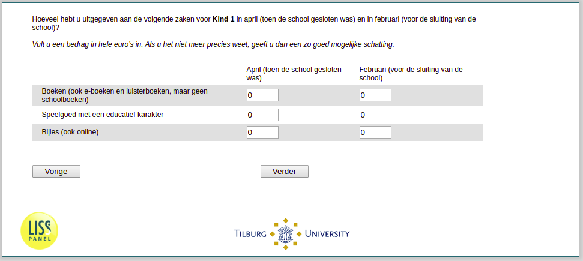

.. _w3e-v3_bokind:

 
 .. role:: raw-html(raw) 
        :format: html 

`v3_bokind` – Spending on Children
==================================

:raw-html:`←` :ref:`w3e-v2_bokind` | :ref:`w3e-v4_bokind` :raw-html:`→` 

*Routing to the question depends on answer in:* :ref:`w3e-v0`

How much did you spend on the following things for ^v1_bo_kind1.bonaam; in April (when the school was closed) and in February (before the school closed)?

Please fill in an amount in whole euros. If you can't remember exactly, please give your best estimate.

.. csv-table::
   :delim: |
   :header: ,April, February

           Books (also e-books and audiobooks, but no schoolbooks) | :raw-html:`<form><input type="text" id="fname" name="fname"> </form>`|:raw-html:`<form><input type="text" id="fname" name="fname"> </form>`
           Toys with an educational character | :raw-html:`<form><input type="text" id="fname" name="fname"> </form>`|:raw-html:`<form><input type="text" id="fname" name="fname"> </form>`
           Tutoring (also online) | :raw-html:`<form><input type="text" id="fname" name="fname"> </form>`|:raw-html:`<form><input type="text" id="fname" name="fname"> </form>`

:raw-html:`&larr;` :ref:`w3e-v2_bokind` | :ref:`w3e-v4_bokind` :raw-html:`&rarr;` 

