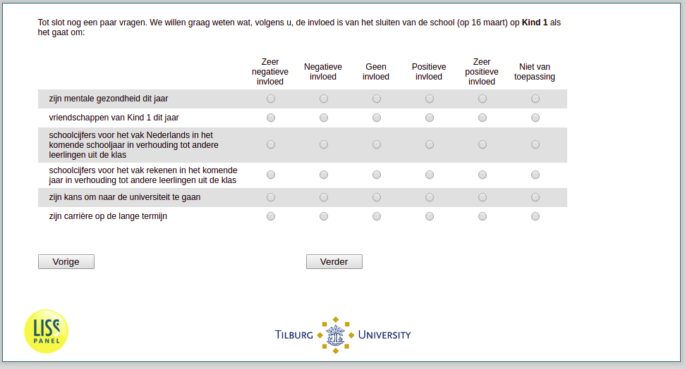

.. _w3e-v5_bokind: 

 
 .. role:: raw-html(raw) 
        :format: html 
 
`v5_bokind` – School Closing
======================================== 

:raw-html:`&larr;` :ref:`w3e-v4_bokind` | :ref:`w3e-v6_bokind` :raw-html:`&rarr;` 
 
*Routing to the question depends on answer in:* :ref:`w3e-v0` 

Finally, a few more questions. We would like to know what, in your opinion, is the impact of closing the school (on March 16) on children when it comes to:
 
.. csv-table:: 
   :delim: | 
   :header: ,Very negative influence, Negative influence, No influence, Positive influence, Very positive influence, Not applicable
 
           His mental health this year | :raw-html:`&#10063;`|:raw-html:`&#10063;`|:raw-html:`&#10063;`|:raw-html:`&#10063;`|:raw-html:`&#10063;`|:raw-html:`&#10063;` 
           friendships of child this year | :raw-html:`&#10063;`|:raw-html:`&#10063;`|:raw-html:`&#10063;`|:raw-html:`&#10063;`|:raw-html:`&#10063;`|:raw-html:`&#10063;` 
           school grades for the subject of Dutch in the coming school year in relation to other students in the class | :raw-html:`&#10063;`|:raw-html:`&#10063;`|:raw-html:`&#10063;`|:raw-html:`&#10063;`|:raw-html:`&#10063;`|:raw-html:`&#10063;` 
           His chance to go to college | :raw-html:`&#10063;`|:raw-html:`&#10063;`|:raw-html:`&#10063;`|:raw-html:`&#10063;`|:raw-html:`&#10063;`|:raw-html:`&#10063;` 
           His long-term career | :raw-html:`&#10063;`|:raw-html:`&#10063;`|:raw-html:`&#10063;`|:raw-html:`&#10063;`|:raw-html:`&#10063;`|:raw-html:`&#10063;` 

:raw-html:`&larr;` :ref:`w3e-v4_bokind` | :ref:`w3e-v6_bokind` :raw-html:`&rarr;` 
 
