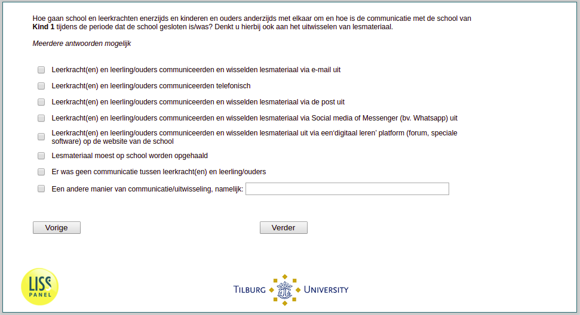

.. _w3e-v6_bokind: 

 
 .. role:: raw-html(raw) 
        :format: html 
 
`v6_bokind` – Learning during School Closures
========================================================= 

:raw-html:`&larr;` :ref:`w3e-v5_bokind` | :ref:`w3e-eva2h` :raw-html:`&rarr;` 
 
*Routing to the question depends on answer in:* :ref:`w3e-v0` 

How do schools and teachers on the one hand and children and parents on the other hand interact and what is the communication with the child's school during the period that the school is / was closed? You can also think of exchanging teaching materials. Multiple answers possible
 
:raw-html:`&#10063;` – Teacher(s) and pupil/parents communicated and exchanged teaching material by e-mail
 
:raw-html:`&#10063;` – Teacher(s) and pupil/parents communicated by telephone
 
:raw-html:`&#10063;` – Teacher(s) and pupil/parents communicated and exchanged teaching material by post
 
:raw-html:`&#10063;` – Teacher(s) and pupil/parents communicated and exchanged teaching material via Social media or Messenger (e.g. Whatsapp).
 
:raw-html:`&#10063;` – Teacher(s) and pupil/parents communicated and exchanged learning materials via a 'digital learning' platform (forum, special software) on the school's website.
 
:raw-html:`&#10063;` – Teaching materials had to be picked up at school
 
:raw-html:`&#10063;` – There was no communication between teacher(s) and pupil/parents
 
:raw-html:`&#10063;` – Another way of communication/exchange, namely:
 

:raw-html:`&larr;` :ref:`w3e-v5_bokind` | :ref:`w3e-eva2h` :raw-html:`&rarr;` 
 
