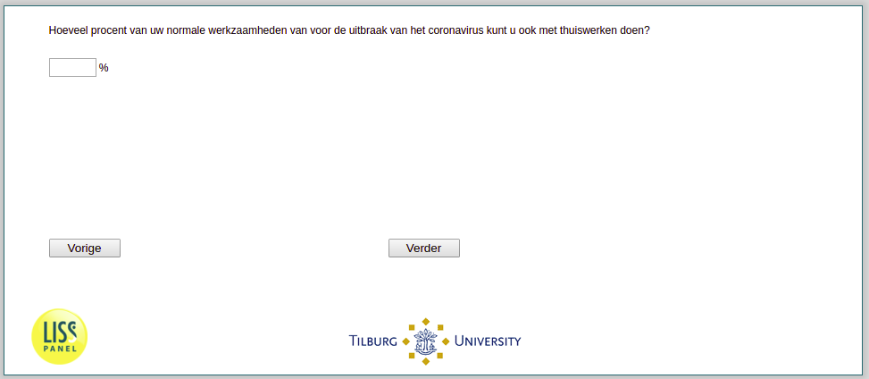

.. _w3e-work_perc: 

 
 .. role:: raw-html(raw) 
        :format: html 
 
`work_perc` – Working from Home Capacity
==================================================== 

:raw-html:`&larr;` :ref:`w3e-vacsick` | :ref:`w3e-q16a` :raw-html:`&rarr;` 
 
*Routing to the question depends on answer in:* :ref:`w3e-EmploymentStatus` 

What percentage of your normal work prior to the coronavirus outbreak can you do while working from home? 
 

:raw-html:`&larr;` :ref:`w3e-vacsick` | :ref:`w3e-q16a` :raw-html:`&rarr;` 
 
