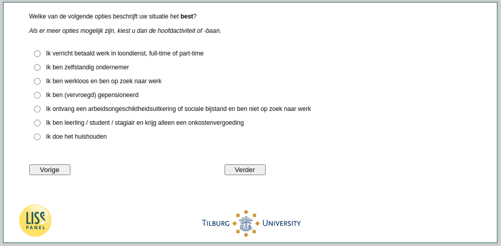

.. _w4d-EmploymentStatus: 

 
 .. role:: raw-html(raw) 
        :format: html 
 
`EmploymentStatus` – Employment Status
========================================================= 

:raw-html:`←` :ref:`w4d-duration` | :ref:`w4d-q14` :raw-html:`→` 
 

Welke van de volgende opties beschrijft uw situatie het best? Als er meer opties mogelijk zijn, kiest u dan de hoofdactiviteit of -baan.
 
.. csv-table:: 
   :delim: | 
   :header: Ik verricht betaald werk in loondienst( full-time of part-time), Ik ben zelfstandig ondernemer, Ik ben werkloos en ben op zoek naar werk, Ik ben (vervroegd) gepensioneerd, Ik ben (vervroegd) gepensioneerd, Ik ontvang een arbeidsongeschiktheidsuitkering of sociale bijstand en ben niet op zoek naar werk, Ik ben leerling / student / stagiair en krijg alleen een onkostenvergoeding
 
           :raw-html:`❏`|:raw-html:`❏`|:raw-html:`❏`|:raw-html:`❏`|:raw-html:`❏`|:raw-html:`❏`|:raw-html:`❏` 

:raw-html:`←` :ref:`w4d-duration` | :ref:`w4d-q14` :raw-html:`→` 
 
