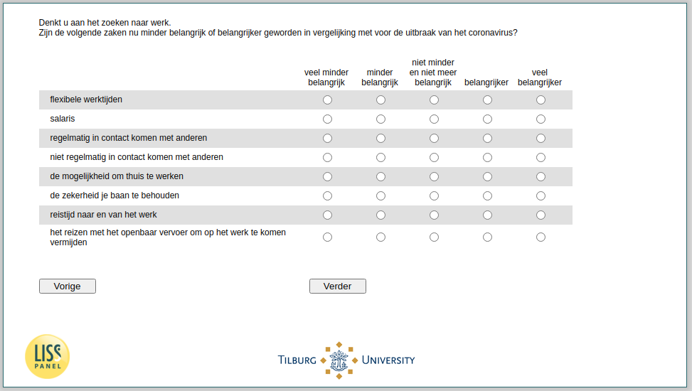

.. _w4d-JobChar: 

 
 .. role:: raw-html(raw) 
        :format: html 
 
`JobChar` – Relative Importance Job Characteristics
============================================================= 

:raw-html:`←` :ref:`w4d-JobWage` | :ref:`w4d-PosJobChar` :raw-html:`→` 
 
*Routing to the question depends on answer in:* :ref:`w4d-ws058` 

Denkt u aan het zoeken naar werk.Zijn de volgende zaken nu minder belangrijk of belangrijker geworden in vergelijking met voor de uitbraak van het coronavirus?
 
.. csv-table:: 
   :delim: | 
   :header: ,veel minder belangrijk, minder belangrijk, niet minder en niet meer belangrijk, Belangrijker,veel belangrijker
 
           flexibele werktijden | :raw-html:`❏`|:raw-html:`❏`|:raw-html:`❏`|:raw-html:`❏`|:raw-html:`❏` 
           salaris | :raw-html:`❏`|:raw-html:`❏`|:raw-html:`❏`|:raw-html:`❏`|:raw-html:`❏` 
           regelmatig in contact komen met anderen | :raw-html:`❏`|:raw-html:`❏`|:raw-html:`❏`|:raw-html:`❏`|:raw-html:`❏` 
           niet regelmatig in contact komen met anderen | :raw-html:`❏`|:raw-html:`❏`|:raw-html:`❏`|:raw-html:`❏`|:raw-html:`❏` 
           de mogelijkheid om thuis te werken | :raw-html:`❏`|:raw-html:`❏`|:raw-html:`❏`|:raw-html:`❏`|:raw-html:`❏` 
           de zekerheid je baan te behouden | :raw-html:`❏`|:raw-html:`❏`|:raw-html:`❏`|:raw-html:`❏`|:raw-html:`❏` 
           reistijd naar en van het werk | :raw-html:`❏`|:raw-html:`❏`|:raw-html:`❏`|:raw-html:`❏`|:raw-html:`❏` 
           het reizen met het openbaar vervoer om op het werk te komen vermijden | :raw-html:`❏`|:raw-html:`❏`|:raw-html:`❏`|:raw-html:`❏`|:raw-html:`❏` 

:raw-html:`←` :ref:`w4d-JobWage` | :ref:`w4d-PosJobChar` :raw-html:`→` 
 
