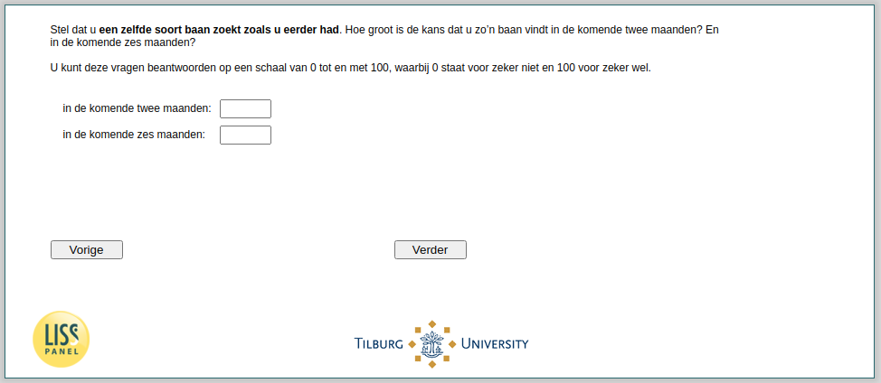

.. _w4d-beliefs1: 

 
 .. role:: raw-html(raw) 
        :format: html 
 
`beliefs1` – Unemployed - Beliefs Job Seach: Similar Job As Before
============================================================================= 

:raw-html:`&larr;` :ref:`w4d-q4_header` | :ref:`w4d-beliefs2` :raw-html:`&rarr;` 
 
*Routing to the question depends on answer in:* :ref:`w4d-EmploymentStatus` 

Stel dat u een zelfde soort baan zoekt zoals u eerder had. Hoe groot is de kans dat u zo’n baan vindt in de komende twee maanden? En in de komende zes maanden?U kunt deze vragen beantwoorden op een schaal van 0 tot en met 100, waarbij 0 staat voor zeker niet en 100 voor zeker wel.
 
.. csv-table:: 
   :delim: | 
 
           in de komende twee maanden: | :raw-html:`<form><input type="text" id="fname" name="fname"> </form>` 
           in de komende zes maanden: | :raw-html:`<form><input type="text" id="fname" name="fname"> </form>` 

:raw-html:`&larr;` :ref:`w4d-q4_header` | :ref:`w4d-beliefs2` :raw-html:`&rarr;` 
 
