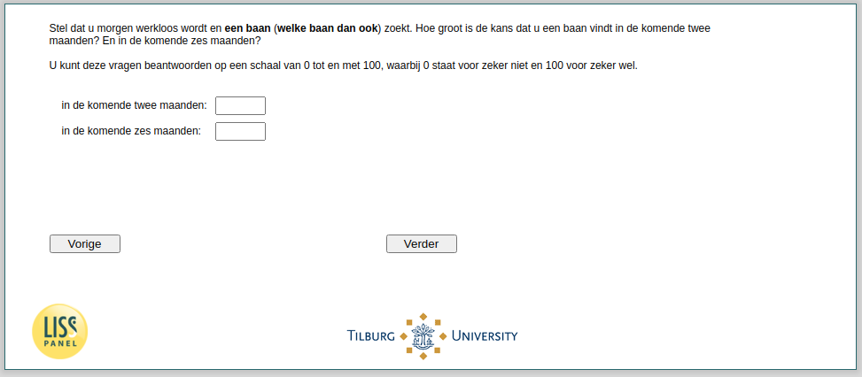

.. _w4d-beliefs7: 

 
 .. role:: raw-html(raw) 
        :format: html 
 
`beliefs7` – Employed – Beliefs Job Seach: Any Job
============================================================= 

:raw-html:`&larr;` :ref:`w4d-beliefs6` | :ref:`w4d-beliefs8` :raw-html:`&rarr;` 
 
*Routing to the question depends on answer in:* :ref:`w4d-EmploymentStatus` 

Stel dat u morgen werkloos wordt en een baan (welke baan dan ook) zoekt. Hoe groot is de kans dat u een baan vindt in de komende twee maanden? En in de komende zes maanden?U kunt deze vragen beantwoorden op een schaal van 0 tot en met 100, waarbij 0 staat voor zeker niet en 100 voor zeker wel.
 
.. csv-table:: 
   :delim: | 
 
           in de komende twee maanden: | :raw-html:`<form><input type="text" id="fname" name="fname"> </form>` 
           in de komende zes maanden: | :raw-html:`<form><input type="text" id="fname" name="fname"> </form>` 

:raw-html:`&larr;` :ref:`w4d-beliefs6` | :ref:`w4d-beliefs8` :raw-html:`&rarr;` 
 
