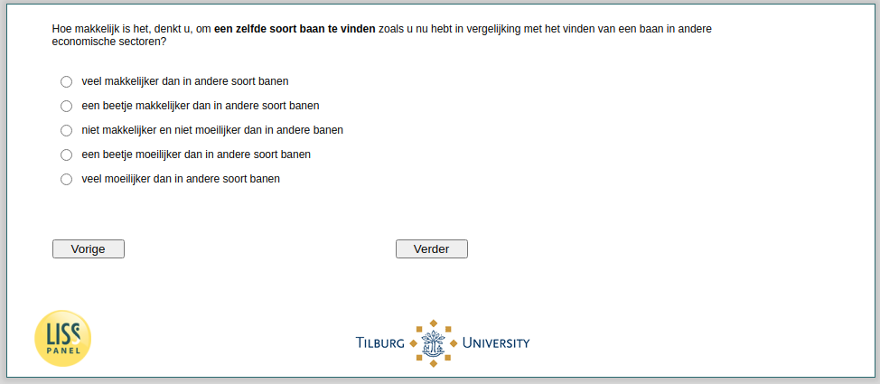

.. _w4d-beliefs8: 

 
 .. role:: raw-html(raw) 
        :format: html 
 
`beliefs8` – Employed – Beliefs Job Search Compared to Other Sectors
=============================================================================== 

:raw-html:`&larr;` :ref:`w4d-beliefs7` | :ref:`w4d-beliefs9` :raw-html:`&rarr;` 
 
*Routing to the question depends on answer in:* :ref:`w4d-EmploymentStatus` 

Hoe makkelijk is het, denkt u, om een zelfde soort baan te vinden zoals u nu hebt in vergelijking met het vinden van een baan in andere economische sectoren?
 
.. csv-table:: 
   :delim: | 
   :header: veel makkelijker dan in andere soort banen, een beetje makkelijker dan in andere soort banen, niet makkelijker en niet moeilijker dan in andere banen, een beetje moeilijker dan in andere soort banen, veel moeilijker dan in andere soort banen
 
           :raw-html:`&#10063;`|:raw-html:`&#10063;`|:raw-html:`&#10063;`|:raw-html:`&#10063;`|:raw-html:`&#10063;` 

:raw-html:`&larr;` :ref:`w4d-beliefs7` | :ref:`w4d-beliefs9` :raw-html:`&rarr;` 
 
