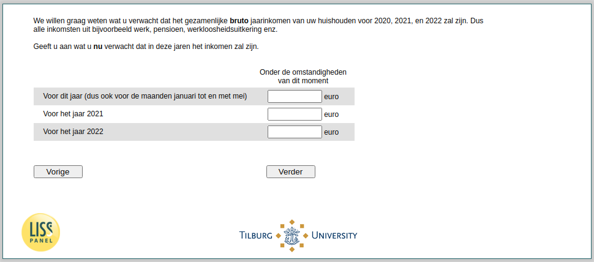

.. _w4d-expectedincome: 

 
 .. role:: raw-html(raw) 
        :format: html 
 
`expectedincome` – Expected Income
=================================================== 

:raw-html:`&larr;` :ref:`w4d-income` | :ref:`w4d-v0` :raw-html:`&rarr;` 
 

We willen graag weten wat u verwacht dat het gezamenlijke bruto jaarinkomen van uw huishouden voor 2020, 2021, en 2022 zal zijn. Dus alle inkomsten uit bijvoorbeeld werk, pensioen, werkloosheidsuitkering enz.

Geeft u aan wat u nu verwacht dat in deze jaren het inkomen zal zijn.
 
 
.. csv-table:: 
   :delim: | 
   :header: ,Vóórdat er sprake was van de uitbraak van het coronavirus, Onder de omstandigheden van dit moment 
 
           Voor dit jaar (dus ook voor de maanden  | :raw-html:`<form><input type="text" id="fname" name="fname"> </form>` |:raw-html:`<form><input type="text" id="fname" name="fname"> </form>` 
           Voor het jaar 2021   | :raw-html:`<form><input type="text" id="fname" name="fname"> </form>` |:raw-html:`<form><input type="text" id="fname" name="fname"> </form>` 
           Voor het jaar 2022  | :raw-html:`<form><input type="text" id="fname" name="fname"> </form>` |:raw-html:`<form><input type="text" id="fname" name="fname"> </form>` 

:raw-html:`&larr;` :ref:`w4d-income` | :ref:`w4d-v0` :raw-html:`&rarr;` 
 
