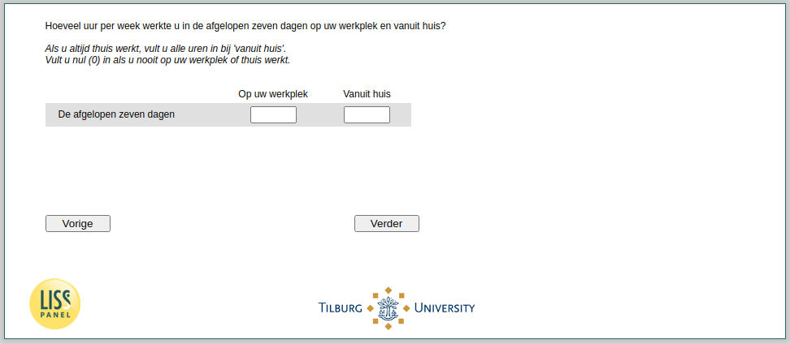

.. _w4d-q14: 

 
 .. role:: raw-html(raw) 
        :format: html 
 
`q14` – Work Time Remote and Workplace
============================================ 

:raw-html:`&larr;` :ref:`w4d-EmploymentStatus` | :ref:`w4d-change_empl` :raw-html:`&rarr;` 
 
*Routing to the question depends on answer in:* :ref:`w4d-EmploymentStatus` 

Hoeveel uur per week werkte u in de afgelopen zeven dagen op uw werkplek en vanuit huis? Als u altijd thuis werkt, vult u alle uren in bij 'vanuit huis'. Vult u nul (0) in als u nooit op uw werkplek of thuis werkt.
 
.. csv-table:: 
   :delim: | 
   :header: ,De afgelopen zeven dagen
 
           Op uw werkplek | :raw-html:`<form><input type="text" id="fname" name="fname"> </form>` 
           Vanuit huis  | :raw-html:`<form><input type="text" id="fname" name="fname"> </form>` 

:raw-html:`&larr;` :ref:`w4d-EmploymentStatus` | :ref:`w4d-change_empl` :raw-html:`&rarr;` 
 
