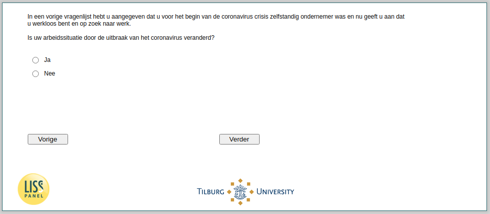

.. _w4d-q2: 

 
 .. role:: raw-html(raw) 
        :format: html 
 
`q2` – Change Employment Situation
======================================= 

:raw-html:`←` :ref:`w4d-change_selfempl` | :ref:`w4d-q4_header` :raw-html:`→` 
 
*Routing to the question depends on answer in:* :ref:`w4d-EmploymentStatus` 

Is uw arbeidssituatie door de uitbraak van het coronavirus veranderd?
 
.. csv-table:: 
   :delim: | 
   :header: Ja, Nee
 
           :raw-html:`❏`|:raw-html:`❏` 

:raw-html:`←` :ref:`w4d-change_selfempl` | :ref:`w4d-q4_header` :raw-html:`→` 
 
