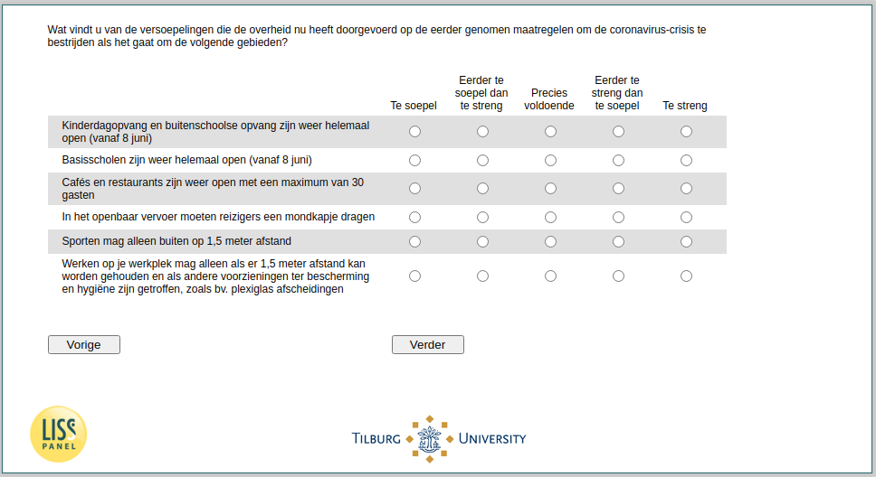

.. _w4d-support: 

 
 .. role:: raw-html(raw) 
        :format: html 
 
`support` – Support Government Policy
=============================================== 

:raw-html:`&larr;` :ref:`w4d-soccont` | :ref:`w4d-avoid` :raw-html:`&rarr;` 
 

Wat vindt u van de versoepelingen die de overheid nu heeft doorgevoerd op de eerder genomen maatregelen om de coronavirus-crisis te bestrijden als het gaat om de volgende gebieden?
 
.. csv-table:: 
   :delim: | 
   :header: ,Te soepel, Eerder te soepel dan te streng, Precies voldoende, Eerder te streng dan te soepel, Te streng
 
           Kinderdagopvang en buitenschoolse opvang zijn weer helemaal open (vanaf 8 juni) | :raw-html:`&#10063;`|:raw-html:`&#10063;`|:raw-html:`&#10063;`|:raw-html:`&#10063;`|:raw-html:`&#10063;` 
           Basisscholen zijn weer helemaal open (vanaf 8 juni) | :raw-html:`&#10063;`|:raw-html:`&#10063;`|:raw-html:`&#10063;`|:raw-html:`&#10063;`|:raw-html:`&#10063;` 
           Cafés en restaurants zijn weer open met een maximum van 30 gasten | :raw-html:`&#10063;`|:raw-html:`&#10063;`|:raw-html:`&#10063;`|:raw-html:`&#10063;`|:raw-html:`&#10063;` 
           In het openbaar vervoer moeten reizigers een mondkapje dragen | :raw-html:`&#10063;`|:raw-html:`&#10063;`|:raw-html:`&#10063;`|:raw-html:`&#10063;`|:raw-html:`&#10063;` 
           Sporten mag alleen buiten op 1,5 meter afstand | :raw-html:`&#10063;`|:raw-html:`&#10063;`|:raw-html:`&#10063;`|:raw-html:`&#10063;`|:raw-html:`&#10063;` 
           Werken op je werkplek mag alleen als er 1,5 meter afstand kan worden gehouden en als andere voorzieningen ter bescherming en hygiëne zijn getroffen, zoals bv. plexiglas afscheidingen | :raw-html:`&#10063;`|:raw-html:`&#10063;`|:raw-html:`&#10063;`|:raw-html:`&#10063;`|:raw-html:`&#10063;` 

:raw-html:`&larr;` :ref:`w4d-soccont` | :ref:`w4d-avoid` :raw-html:`&rarr;` 
 
