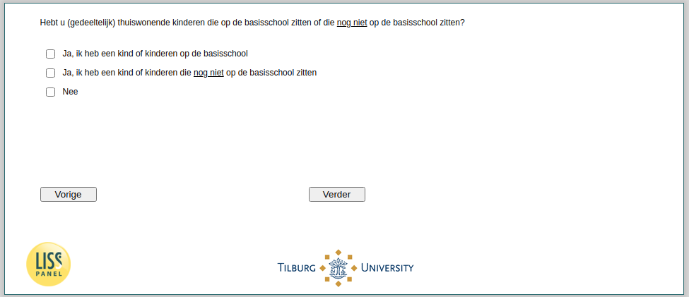

.. _w4d-v0: 

 
 .. role:: raw-html(raw) 
        :format: html 
 
`v0` – School Aged Children in Household
============================================= 

:raw-html:`&larr;` :ref:`w4d-expectedincome` | :ref:`w4d-v0a` :raw-html:`&rarr;` 
 

Hebt u (gedeeltelijk) thuiswonende kinderen die op de basisschool zitten of die nog niet op de basisschool zitten?
 
:raw-html:`&#10063;` – Ja, ik heb een kind of kinderen op de basisschool
 
:raw-html:`&#10063;` – Ja, ik heb een kind of kinderen die nog niet op de basisschool zitten
 
:raw-html:`&#10063;` – Ja, ik heb een kind of kinderen die nog niet op de basisschool zitten
 

:raw-html:`&larr;` :ref:`w4d-expectedincome` | :ref:`w4d-v0a` :raw-html:`&rarr;` 
 
