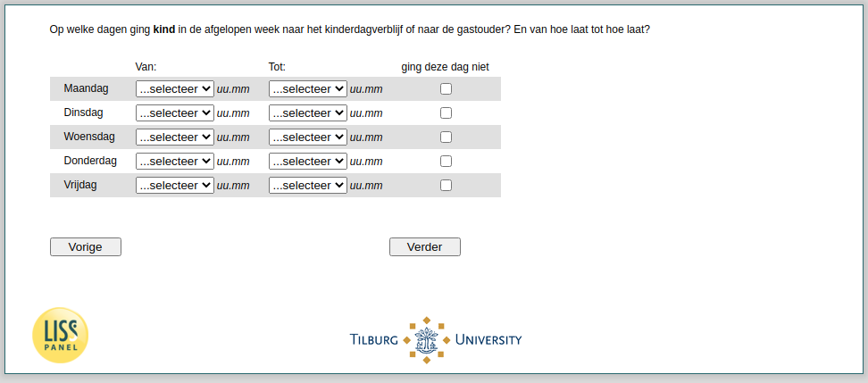

.. _w4d-v2_vokind: 

 
 .. role:: raw-html(raw) 
        :format: html 
 
`v2_vokind` – Times Attendance Kindergarden
======================================================= 

:raw-html:`&larr;` :ref:`w4d-v2_vokind_cat` | :ref:`w4d-v3_vokind` :raw-html:`&rarr;` 
 
*Routing to the question depends on answer in:* :ref:`w4d-v0b` 

Op welke dagen ging kind in de afgelopen week naar het kinderdagverblijf of naar de gastouder? En van hoe laat tot hoe laat?
 
.. csv-table:: 
   :delim: | 
   :header: ,Van:, Tot:, ging deze dag niet
 
           Maandag | :raw-html:`<form><input type="text" id="fname" name="fname"> </form>` |:raw-html:`<form><input type="text" id="fname" name="fname"> </form>` |:raw-html:`<form><input type="text" id="fname" name="fname"> </form>` 
           Dinsdag | :raw-html:`<form><input type="text" id="fname" name="fname"> </form>` |:raw-html:`<form><input type="text" id="fname" name="fname"> </form>` |:raw-html:`<form><input type="text" id="fname" name="fname"> </form>` 
           Woensdag | :raw-html:`<form><input type="text" id="fname" name="fname"> </form>` |:raw-html:`<form><input type="text" id="fname" name="fname"> </form>` |:raw-html:`<form><input type="text" id="fname" name="fname"> </form>` 
           Donderdag | :raw-html:`<form><input type="text" id="fname" name="fname"> </form>` |:raw-html:`<form><input type="text" id="fname" name="fname"> </form>` |:raw-html:`<form><input type="text" id="fname" name="fname"> </form>` 
           Vrijdag | :raw-html:`<form><input type="text" id="fname" name="fname"> </form>` |:raw-html:`<form><input type="text" id="fname" name="fname"> </form>` |:raw-html:`<form><input type="text" id="fname" name="fname"> </form>` 

:raw-html:`&larr;` :ref:`w4d-v2_vokind_cat` | :ref:`w4d-v3_vokind` :raw-html:`&rarr;` 
 
