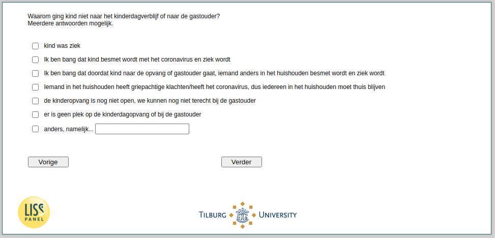

.. _w4d-v3_vokind: 

 
 .. role:: raw-html(raw) 
        :format: html 
 
`v3_vokind` – Reasons no Kindergarden Attendance
============================================================ 

:raw-html:`&larr;` :ref:`w4d-v2_vokind` 
 
*Routing to the question depends on answer in:* :ref:`w4d-v2_vokind` 

Waarom ging kind niet naar het kinderdagverblijf of naar de gastouder? Meerdere antwoorden mogelijk.
 
:raw-html:`&#10063;` – Kind was ziek
 
:raw-html:`&#10063;` – Ik ben bang dat kind besmet wordt met het coronavirus en ziek wordt
 
:raw-html:`&#10063;` – Ik ben bang dat doordat kind naar de opvang of gastouder gaat, iemand anders in het huishouden besmet wordt en ziek wordt
 
:raw-html:`&#10063;` – Iemand in het huishouden heeft griepachtige klachten/heeft het coronavirus, dus iedereen in het huishouden moet thuis blijven
 
:raw-html:`&#10063;` – de buitenschoolse opvang is nog niet open, we kunnen nog niet terecht bij de gastouder
 
:raw-html:`&#10063;` – er is geen plek op de kinderdagopvang of bij de gastouder
 
:raw-html:`&#10063;` – we maken voor kind geen gebruik van het kinderdagverblijf of een gastouder
 
:raw-html:`&#10063;` – anders, namelijk...
 

:raw-html:`&larr;` :ref:`w4d-v2_vokind` 
 
