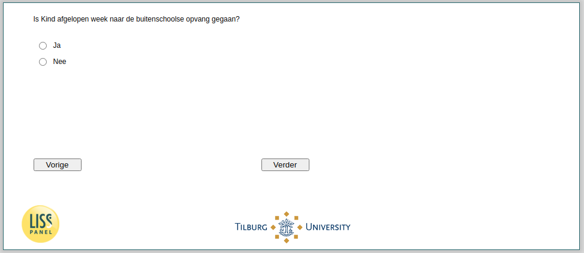

.. _w4d-v4_bokind: 

 
 .. role:: raw-html(raw) 
        :format: html 
 
`v4_bokind` – Attendance Out-of-School Care
======================================================= 

:raw-html:`←` :ref:`w4d-v3_bokind` | :ref:`w4d-v5_bokind` :raw-html:`→` 
 
*Routing to the question depends on answer in:* :ref:`w4d-v0a` 

Is Kind afgelopen week naar de buitenschoolse opvang gegaan?
 
.. csv-table:: 
   :delim: | 
   :header: Ja, Nee
 
           :raw-html:`❏`|:raw-html:`❏` 

:raw-html:`←` :ref:`w4d-v3_bokind` | :ref:`w4d-v5_bokind` :raw-html:`→` 
 
