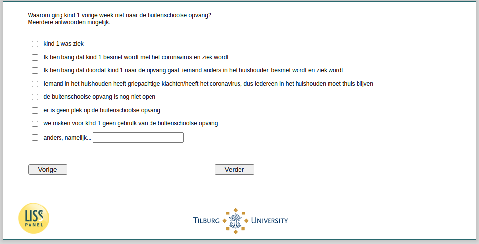

.. _w4d-v5_bokind: 

 
 .. role:: raw-html(raw) 
        :format: html 
 
`v5_bokind` – Reasons No Out-of-School Care
======================================================= 

:raw-html:`&larr;` :ref:`w4d-v4_bokind` | :ref:`w4d-v2_vokind_cat` :raw-html:`&rarr;` 
 
*Routing to the question depends on answer in:* :ref:`w4d-v4_bokind` 

Waarom ging kind vorige week niet naar de buitenschoolse opvang? Meerdere antwoorden mogelijk.
 
:raw-html:`&#10063;` – Kind was ziek
 
:raw-html:`&#10063;` – Ik ben bang dat kind besmet wordt met het coronavirus en ziek wordt
 
:raw-html:`&#10063;` – Ik ben bang dat doordat kind naar de opvang gaat, iemand anders in het huishouden besmet wordt en ziek wordt
 
:raw-html:`&#10063;` – Iemand in het huishouden heeft griepachtige klachten/heeft het coronavirus, dus iedereen in het huishouden moet thuis blijven
 
:raw-html:`&#10063;` – de buitenschoolse opvang is nog niet open
 
:raw-html:`&#10063;` – er is geen plek op de buitenschoolse opvang
 
:raw-html:`&#10063;` – we maken voor kind geen gebruik van de buitenschoolse opvang
 
:raw-html:`&#10063;` – anders, namelijk...
 

:raw-html:`&larr;` :ref:`w4d-v4_bokind` | :ref:`w4d-v2_vokind_cat` :raw-html:`&rarr;` 
 
