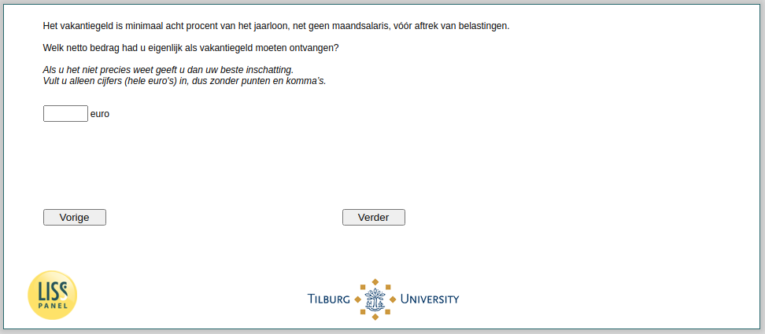

.. _w4d-vakantiegeld2: 

 
 .. role:: raw-html(raw) 
        :format: html 
 
`vakantiegeld2` – Should Receive Holiday Pay
============================================================ 

:raw-html:`&larr;` :ref:`w4d-vakantiegeld1` | :ref:`w4d-vakantiegeld2b` :raw-html:`&rarr;` 
 
*Routing to the question depends on answer in:* :ref:`w4d-vakantiegeld1` 

Het vakantiegeld is minimaal acht procent van het jaarloon, net geen maandsalaris, vóór aftrek van belastingen.[Welk netto bedrag hebt u als vakantiegeld ontvangen?/Welk netto bedrag had u als vakantiegeld moeten ontvangen en welk bedrag hebt u ontvangen?/Welk netto bedrag had u eigenlijk als vakantiegeld moeten ontvangen?]
Als u het niet precies weet geeft u dan uw beste inschatting.Vult u alleen cijfers (hele euro's) in, dus zonder punten en komma’s. 
 

:raw-html:`&larr;` :ref:`w4d-vakantiegeld1` | :ref:`w4d-vakantiegeld2b` :raw-html:`&rarr;` 
 
