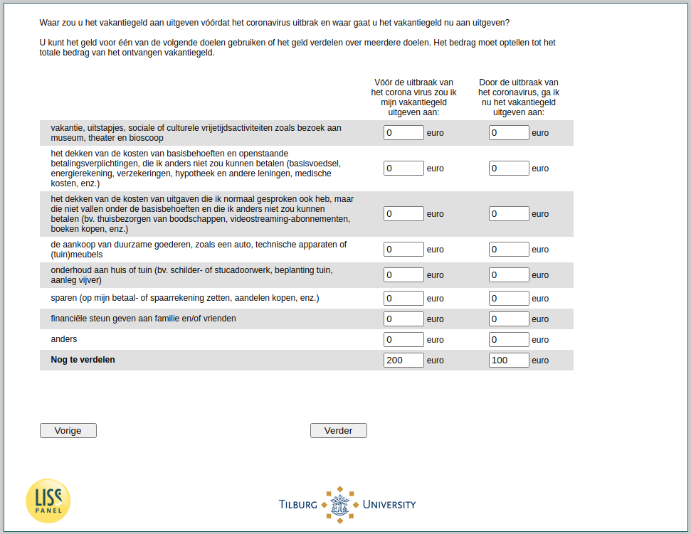

.. _w4d-vakantiegeld3: 

 
 .. role:: raw-html(raw) 
        :format: html 
 
`vakantiegeld3` – Spending Holiday Pay
====================================================== 

:raw-html:`&larr;` :ref:`w4d-vakantiegeld2b` | :ref:`w4d-income` :raw-html:`&rarr;` 
 
*Routing to the question depends on answer in:* :ref:`w4d-vakantiegeld1` 

Waar zou u het vakantiegeld aan uitgeven vóórdat het coronavirus uitbrak en waar [gaat u het vakantiegeld nu aan uitgeven/zou u het vakantiegeld nu aan hebben uitgegeven uitgeven als u dit wel had ontvangen]?U kunt het geld voor één van de volgende doelen gebruiken of het geld verdelen over meerdere doelen. Het bedrag moet optellen tot het totale bedrag van het [ontvangen vakantiegeld/vakantiegeld dat u anders zou hebben ontvangen].
 
.. csv-table:: 
   :delim: | 
   :header: ,Vóór de uitbraak van het corona virus zou ik mijn vakantiegeld uitgeven aan:, Door de uitbraak van het coronavirus, [ga/zou] ik nu het vakantiegeld uitgeven
 
           vakantie, uitstapjes, sociale of culturele vrijetijdsactiviteiten zoals bezoek aan museum, theater en bioscoop | :raw-html:`<form><input type="text" id="fname" name="fname"> </form>` |:raw-html:`<form><input type="text" id="fname" name="fname"> </form>` |:raw-html:`<form><input type="text" id="fname" name="fname"> </form>` 
           het dekken van de kosten van basisbehoeften en openstaande betalingsverplichtingen, die ik anders niet zou kunnen betalen (basisvoedsel, energierekening, verzekeringen, hypotheek en andere leningen, medische kosten, enz.) | :raw-html:`<form><input type="text" id="fname" name="fname"> </form>` |:raw-html:`<form><input type="text" id="fname" name="fname"> </form>` |:raw-html:`<form><input type="text" id="fname" name="fname"> </form>` 
           het dekken van de kosten van uitgaven die ik normaal gesproken ook heb, maar die niet vallen onder de basisbehoeften en die ik anders niet zou kunnen betalen (bv. thuisbezorgen van boodschappen, videostreaming-abonnementen, boeken kopen, enz.) | :raw-html:`<form><input type="text" id="fname" name="fname"> </form>` |:raw-html:`<form><input type="text" id="fname" name="fname"> </form>` |:raw-html:`<form><input type="text" id="fname" name="fname"> </form>` 
           de aankoop van duurzame goederen, zoals een auto, technische apparaten of (tuin)meubels | :raw-html:`<form><input type="text" id="fname" name="fname"> </form>` |:raw-html:`<form><input type="text" id="fname" name="fname"> </form>` |:raw-html:`<form><input type="text" id="fname" name="fname"> </form>` 
           onderhoud aan huis of tuin (bv. schilder- of stucadoorwerk, beplanting tuin, aanleg vijver) | :raw-html:`<form><input type="text" id="fname" name="fname"> </form>` |:raw-html:`<form><input type="text" id="fname" name="fname"> </form>` |:raw-html:`<form><input type="text" id="fname" name="fname"> </form>` 
           sparen (op mijn betaal- of spaarrekening zetten, aandelen kopen,  | :raw-html:`<form><input type="text" id="fname" name="fname"> </form>` |:raw-html:`<form><input type="text" id="fname" name="fname"> </form>` |:raw-html:`<form><input type="text" id="fname" name="fname"> </form>` 
           financiële steun geven aan familie en/of vrienden | :raw-html:`<form><input type="text" id="fname" name="fname"> </form>` |:raw-html:`<form><input type="text" id="fname" name="fname"> </form>` |:raw-html:`<form><input type="text" id="fname" name="fname"> </form>` 
           anders, namelijk… | :raw-html:`<form><input type="text" id="fname" name="fname"> </form>` |:raw-html:`<form><input type="text" id="fname" name="fname"> </form>` |:raw-html:`<form><input type="text" id="fname" name="fname"> </form>` 
           Total | :raw-html:`<form><input type="text" id="fname" name="fname"> </form>` |:raw-html:`<form><input type="text" id="fname" name="fname"> </form>` |:raw-html:`<form><input type="text" id="fname" name="fname"> </form>` 

:raw-html:`&larr;` :ref:`w4d-vakantiegeld2b` | :ref:`w4d-income` :raw-html:`&rarr;` 
 
