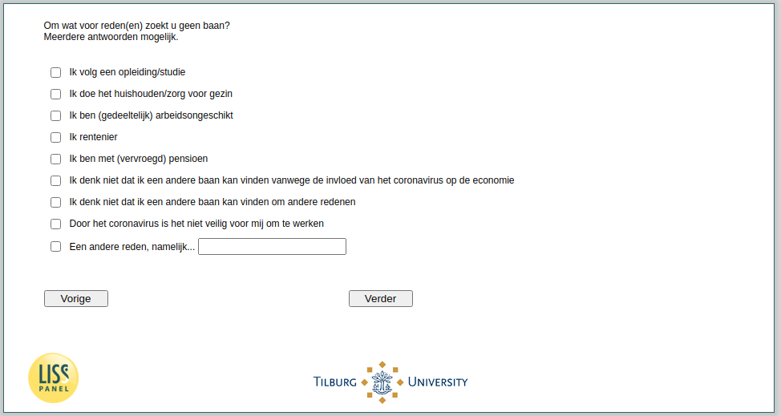

.. _w4d-ws059: 

 
 .. role:: raw-html(raw) 
        :format: html 
 
`ws059` – Reasons No Job Search Among Not (Self-) Employed
================================================================== 

:raw-html:`&larr;` :ref:`w4d-NotLooking` | :ref:`w4d-ws060` :raw-html:`&rarr;` 
 
*Routing to the question depends on answer in:* :ref:`w4d-ws058` 

Om wat voor reden(en) zoekt u geen baan? Meerdere antwoorden mogelijk.
 
:raw-html:`&#10063;` – Ik volg een opleiding/studie
 
:raw-html:`&#10063;` – Ik doe het huishouden/zorg voor gezin
 
:raw-html:`&#10063;` – Ik ben (gedeeltelijk) arbeidsongeschikt
 
:raw-html:`&#10063;` – Ik rentenier
 
:raw-html:`&#10063;` – Ik ben met (vervroegd) pensioen
 
:raw-html:`&#10063;` – Ik denk niet dat ik een andere baan kan vinden vanwege de invloed van het coronavirus op de economie
 
:raw-html:`&#10063;` – Ik denk niet dat ik een andere baan kan vinden om andere redenen
 
:raw-html:`&#10063;` – Door het coronavirus is het niet veilig voor mij om te werken
 
:raw-html:`&#10063;` – Een andere reden, namelijk...
 

:raw-html:`&larr;` :ref:`w4d-NotLooking` | :ref:`w4d-ws060` :raw-html:`&rarr;` 
 
