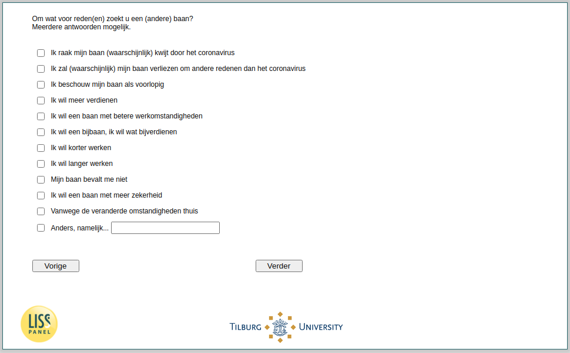

.. _w4d-ws060: 

 
 .. role:: raw-html(raw) 
        :format: html 
 
`ws060` – Reasons Looking for New Job
============================================= 

:raw-html:`&larr;` :ref:`w4d-ws059` | :ref:`w4d-ws063` :raw-html:`&rarr;` 
 
*Routing to the question depends on answer in:* :ref:`w4d-ws058` 

Om wat voor reden(en) zoekt u een (andere) baan? Meerdere antwoorden mogelijk.
 
:raw-html:`&#10063;` – Ik raak mijn baan (waarschijnlijk) kwijt door het coronavirus
 
:raw-html:`&#10063;` – Ik zal (waarschijnlijk) mijn baan verliezen om andere redenen dan het coronavirus
 
:raw-html:`&#10063;` – Ik beschouw mijn baan als voorlopig
 
:raw-html:`&#10063;` – Ik wil meer verdienen
 
:raw-html:`&#10063;` – Ik wil een baan met betere werkomstandigheden
 
:raw-html:`&#10063;` – Ik wil een bijbaan, ik wil wat bijverdienen
 
:raw-html:`&#10063;` – Ik wil korter werken
 
:raw-html:`&#10063;` – Ik wil langer werken
 
:raw-html:`&#10063;` – Mijn baan bevalt me niet
 
:raw-html:`&#10063;` – Ik wil een baan met meer zekerheid
 
:raw-html:`&#10063;` – Vanwege de veranderde omstandigheden thuis
 
:raw-html:`&#10063;` – Anders, namelijk...
 

:raw-html:`&larr;` :ref:`w4d-ws059` | :ref:`w4d-ws063` :raw-html:`&rarr;` 
 
