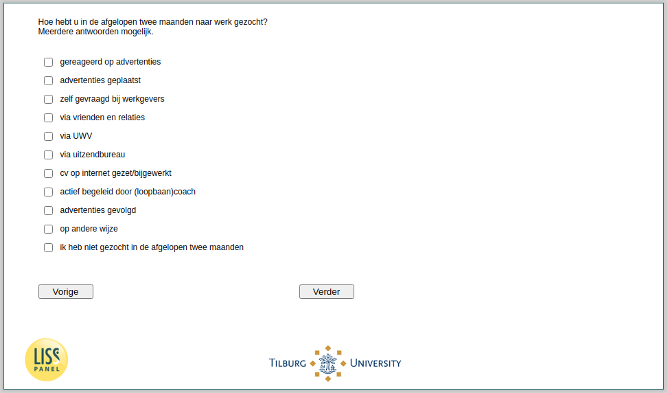

.. _w4d-ws063: 

 
 .. role:: raw-html(raw) 
        :format: html 
 
`ws063` – Job Search Strategy
===================================== 

:raw-html:`&larr;` :ref:`w4d-ws060` | :ref:`w4d-ws064` :raw-html:`&rarr;` 
 
*Routing to the question depends on answer in:* :ref:`w4d-ws058` 

Hoe hebt u in de afgelopen twee maanden naar werk gezocht?Meerdere antwoorden mogelijk.
 
:raw-html:`&#10063;` – gereageerd op advertenties
 
:raw-html:`&#10063;` – advertenties geplaatst
 
:raw-html:`&#10063;` – zelf gevraagd bij werkgevers
 
:raw-html:`&#10063;` – via vrienden en relaties
 
:raw-html:`&#10063;` – via UWV
 
:raw-html:`&#10063;` – via uitzendbureau
 
:raw-html:`&#10063;` – cv op internet gezet/bijgewerkt
 
:raw-html:`&#10063;` – actief begeleid door (loopbaan)coach
 
:raw-html:`&#10063;` – advertenties gevolgd
 
:raw-html:`&#10063;` – op andere wijze
 
:raw-html:`&#10063;` – ik heb niet gezocht in de afgelopen twee maanden
 

:raw-html:`&larr;` :ref:`w4d-ws060` | :ref:`w4d-ws064` :raw-html:`&rarr;` 
 
