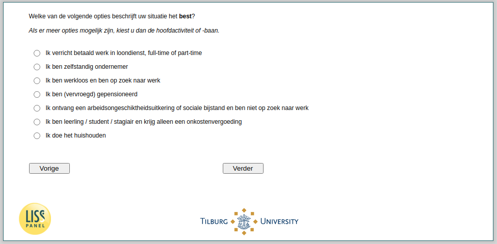

.. _w4e-EmploymentStatus: 

 
 .. role:: raw-html(raw) 
        :format: html 
 
`EmploymentStatus` – Employment Status
========================================================= 

:raw-html:`&larr;` :ref:`w4e-duration` | :ref:`w4e-q14` :raw-html:`&rarr;` 
 

Which of the following best describes your situation? If multiple options are apply, choose the main activity or path.
 
.. csv-table:: 
   :delim: | 
   :header: I do paid work (full-time or part-time), I am self-employed, I am unemployed and looking for work, I am retired (early), I receive disability benefits or social assistance and I am not looking to work, I am an apprentice / student / trainee and only receive an expense allowance, I do the housework
 
           :raw-html:`&#10063;`|:raw-html:`&#10063;`|:raw-html:`&#10063;`|:raw-html:`&#10063;`|:raw-html:`&#10063;`|:raw-html:`&#10063;`|:raw-html:`&#10063;` 

:raw-html:`&larr;` :ref:`w4e-duration` | :ref:`w4e-q14` :raw-html:`&rarr;` 
 
