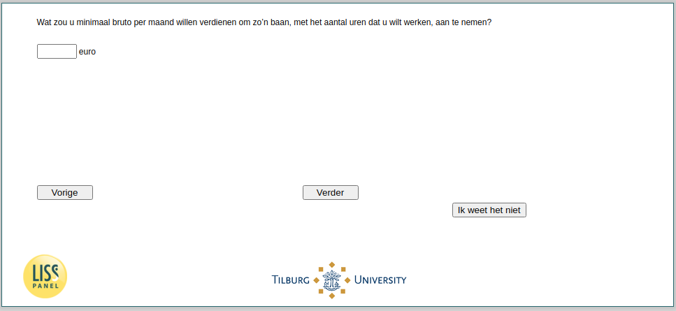

.. _w4e-JobWage: 

 
 .. role:: raw-html(raw) 
        :format: html 
 
`JobWage` – Desired Wage
================================== 

:raw-html:`&larr;` :ref:`w4e-JobHours` | :ref:`w4e-JobChar` :raw-html:`&rarr;` 
 
*Routing to the question depends on answer in:* :ref:`w4e-ws058` 

What would you like to earn at least gross per month to take on such a job, with the number of hours you want to work? 
 

:raw-html:`&larr;` :ref:`w4e-JobHours` | :ref:`w4e-JobChar` :raw-html:`&rarr;` 
 
