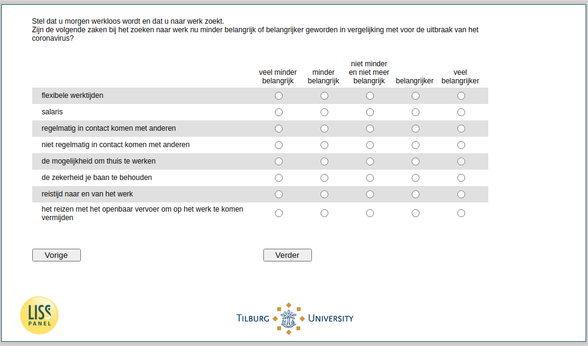

.. _w4e-PosJobChar: 

 
 .. role:: raw-html(raw) 
        :format: html 
 
`PosJobChar` – Relative Importance Job Characteristics During Job Search
===================================================================================== 

:raw-html:`←` :ref:`w4e-JobChar` | :ref:`w4e-vakantiegeld1` :raw-html:`→` 
 
*Routing to the question depends on answer in:* :ref:`w4e-ws058` 

Suppose you become unemployed tomorrow and you are looking for a job, have the following things become less important or more important when looking for a job compared to the coronavirus outbreak?
 
.. csv-table:: 
   :delim: | 
   :header: ,much less important, less important, no less and no more important, more important, much more important
 
           flexible working hours | :raw-html:`❏`|:raw-html:`❏`|:raw-html:`❏`|:raw-html:`❏`|:raw-html:`❏` 
           salary | :raw-html:`❏`|:raw-html:`❏`|:raw-html:`❏`|:raw-html:`❏`|:raw-html:`❏` 
           regular contact with others | :raw-html:`❏`|:raw-html:`❏`|:raw-html:`❏`|:raw-html:`❏`|:raw-html:`❏` 
           not regularly come into contact with others | :raw-html:`❏`|:raw-html:`❏`|:raw-html:`❏`|:raw-html:`❏`|:raw-html:`❏` 
           the ability to work at home | :raw-html:`❏`|:raw-html:`❏`|:raw-html:`❏`|:raw-html:`❏`|:raw-html:`❏` 
           guarantee to keep your job | :raw-html:`❏`|:raw-html:`❏`|:raw-html:`❏`|:raw-html:`❏`|:raw-html:`❏` 
           travel time to and from work | :raw-html:`❏`|:raw-html:`❏`|:raw-html:`❏`|:raw-html:`❏`|:raw-html:`❏` 
           traveling by public transport to be avoided at work | :raw-html:`❏`|:raw-html:`❏`|:raw-html:`❏`|:raw-html:`❏`|:raw-html:`❏` 

:raw-html:`←` :ref:`w4e-JobChar` | :ref:`w4e-vakantiegeld1` :raw-html:`→` 
 
