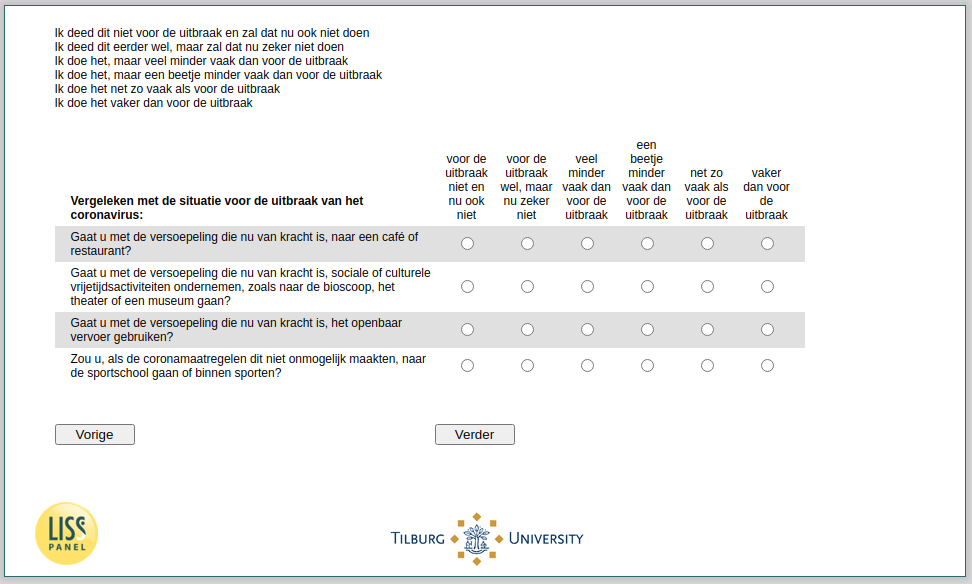

.. _w4e-avoid: 

 
 .. role:: raw-html(raw) 
        :format: html 
 
`avoid` – Avoid Activities
================================== 

:raw-html:`&larr;` :ref:`w4e-support` | :ref:`w4e-duration` :raw-html:`&rarr;` 
 

1 = I did not do this before the outbreak and will not do it now
2 = I did this before, but will certainly not do it now
3 = I do it, but much less often than before the outbreak
4 = I do it, but a little less often than before the outbreak
5 = I do it as often as before the outbreak
6 = I do it more often than before the outbreak

 
.. csv-table:: 
   :delim: | 
   :header: ,1,2,3,4,5,6
 
           … Are you going to a café or restaurant with the current relaxation? | :raw-html:`&#10063;`|:raw-html:`&#10063;`|:raw-html:`&#10063;`|:raw-html:`&#10063;`|:raw-html:`&#10063;`|:raw-html:`&#10063;` 
           … With the relaxation now in force, are you going to undertake social or cultural leisure activities, such as going to the cinema, the theater or a museum? | :raw-html:`&#10063;`|:raw-html:`&#10063;`|:raw-html:`&#10063;`|:raw-html:`&#10063;`|:raw-html:`&#10063;`|:raw-html:`&#10063;` 
           … With the relaxation now in force, are you going to use public transport? | :raw-html:`&#10063;`|:raw-html:`&#10063;`|:raw-html:`&#10063;`|:raw-html:`&#10063;`|:raw-html:`&#10063;`|:raw-html:`&#10063;` 
           … If the corona measures did not make this impossible, would you go to the gym or exercise indoors? | :raw-html:`&#10063;`|:raw-html:`&#10063;`|:raw-html:`&#10063;`|:raw-html:`&#10063;`|:raw-html:`&#10063;`|:raw-html:`&#10063;` 

:raw-html:`&larr;` :ref:`w4e-support` | :ref:`w4e-duration` :raw-html:`&rarr;` 
 
