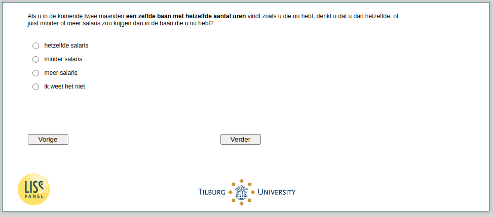

.. _w4e-beliefs10: 

 
 .. role:: raw-html(raw) 
        :format: html 
 
`beliefs10` – Employed – Beliefs Pay in Future Job
============================================================== 

:raw-html:`&larr;` :ref:`w4e-beliefs9` | :ref:`w4e-ws058` :raw-html:`&rarr;` 
 
*Routing to the question depends on answer in:* :ref:`w4e-EmploymentStatus` 

If you find the same job with the same number of hours as you do in the next two months, do you think you would receive the same or less or more salary than you do in the current job?
 
.. csv-table:: 
   :delim: | 
   :header: ,same salary, less salary, more salary, I do not know
 
           nan | :raw-html:`&#10063;`|:raw-html:`&#10063;`|:raw-html:`&#10063;`|:raw-html:`&#10063;` 

:raw-html:`&larr;` :ref:`w4e-beliefs9` | :ref:`w4e-ws058` :raw-html:`&rarr;` 
 
