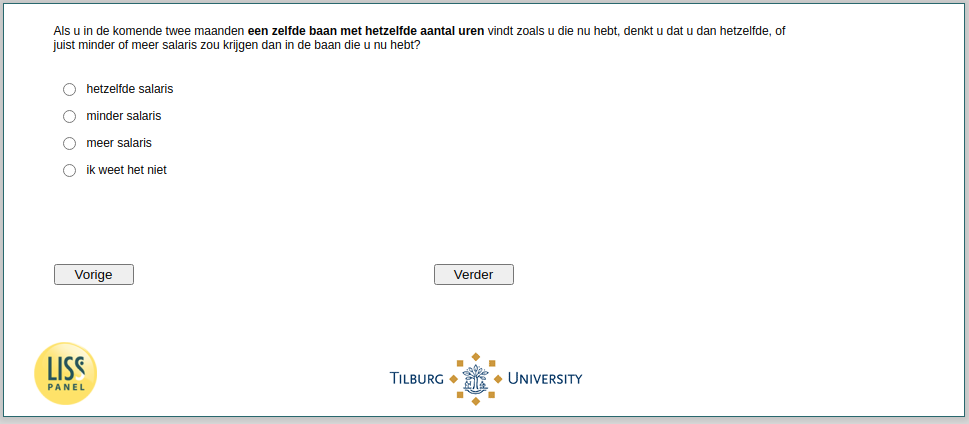

.. _w4e-beliefs5: 

 
 .. role:: raw-html(raw) 
        :format: html 
 
`beliefs5` – Unemployed – Beliefs Pay in Future Job
============================================================== 

:raw-html:`&larr;` :ref:`w4e-beliefs4` | :ref:`w4e-beliefs6` :raw-html:`&rarr;` 
 
*Routing to the question depends on answer in:* :ref:`w4e-EmploymentStatus` 

If you find the same job with the same number of hours in the next two months as you have had before, do you think you would receive the same or less or more salary than in your previous job?
 
.. csv-table:: 
   :delim: | 
   :header: same salary, less salary, more salary, I do not know
 
           :raw-html:`&#10063;`|:raw-html:`&#10063;`|:raw-html:`&#10063;`|:raw-html:`&#10063;` 

:raw-html:`&larr;` :ref:`w4e-beliefs4` | :ref:`w4e-beliefs6` :raw-html:`&rarr;` 
 
