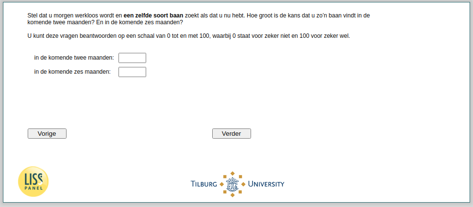

.. _w4e-beliefs6: 

 
 .. role:: raw-html(raw) 
        :format: html 
 
`beliefs6` – Employed - Beliefs Job Seach: Similar Job As Before
=========================================================================== 

:raw-html:`←` :ref:`w4e-beliefs5` | :ref:`w4e-beliefs7` :raw-html:`→` 
 
*Routing to the question depends on answer in:* :ref:`w4e-EmploymentStatus` 

Suppose you become unemployed tomorrow and are looking for the same kind of job that you have now. How likely are you to find such a job in the next two months? And over the next six months, you can answer these questions on a scale from 0 to 100, with 0 representing certainly not and 100 representing certainly.
 
.. csv-table:: 
   :delim: | 
 
           in the next two months: | :raw-html:`<form><input type="text" id="fname" name="fname"> </form>` 
           in the next six months: | :raw-html:`<form><input type="text" id="fname" name="fname"> </form>` 

:raw-html:`&larr;` :ref:`w4e-beliefs5` | :ref:`w4e-beliefs7` :raw-html:`&rarr;` 
 
