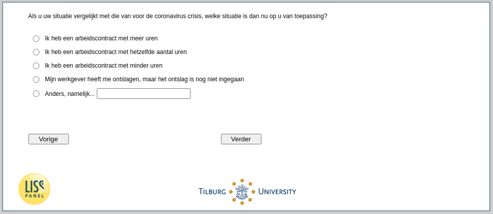

.. _w4e-change_empl: 

 
 .. role:: raw-html(raw) 
        :format: html 
 
`change_empl` – Income Situation (Employees)
========================================================== 

:raw-html:`&larr;` :ref:`w4e-q14` | :ref:`w4e-change_selfempl` :raw-html:`&rarr;` 
 

If you compare your situation with that before the coronavirus crisis, which situation applies to you now?
 
:raw-html:`&#10063;` – I do the housework
 
:raw-html:`&#10063;` – I have a contract with the same number of hours
 
:raw-html:`&#10063;` – I have an employment contract with fewer hours
 
:raw-html:`&#10063;` – My employer fired me, but the dismissal has not yet started
 
:raw-html:`&#10063;` – Otherwise, namely...
 

:raw-html:`&larr;` :ref:`w4e-q14` | :ref:`w4e-change_selfempl` :raw-html:`&rarr;` 
 
