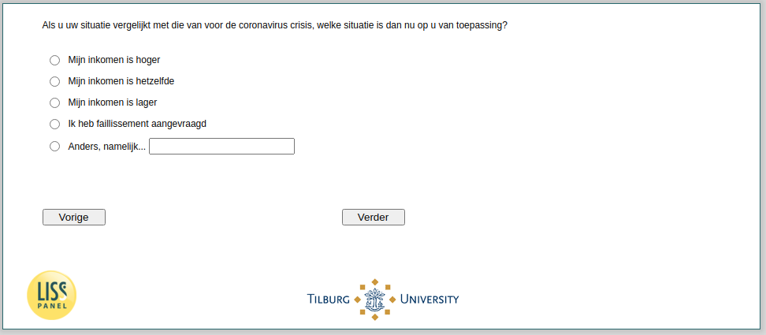

.. _w4e-change_selfempl: 

 
 .. role:: raw-html(raw) 
        :format: html 
 
`change_selfempl` – Income Situation (Self-Employed)
====================================================================== 

:raw-html:`&larr;` :ref:`w4e-change_empl` | :ref:`w4e-q2` :raw-html:`&rarr;` 
 

If you compare your situation with that before the coronavirus crisis, which situation applies to you now?
 
:raw-html:`&#10063;` – My income is higher
 
:raw-html:`&#10063;` – My income is the same
 
:raw-html:`&#10063;` – My income is lower
 
:raw-html:`&#10063;` – I filed for bankruptcy
 
:raw-html:`&#10063;` – Otherwise, namely...
 

:raw-html:`&larr;` :ref:`w4e-change_empl` | :ref:`w4e-q2` :raw-html:`&rarr;` 
 
