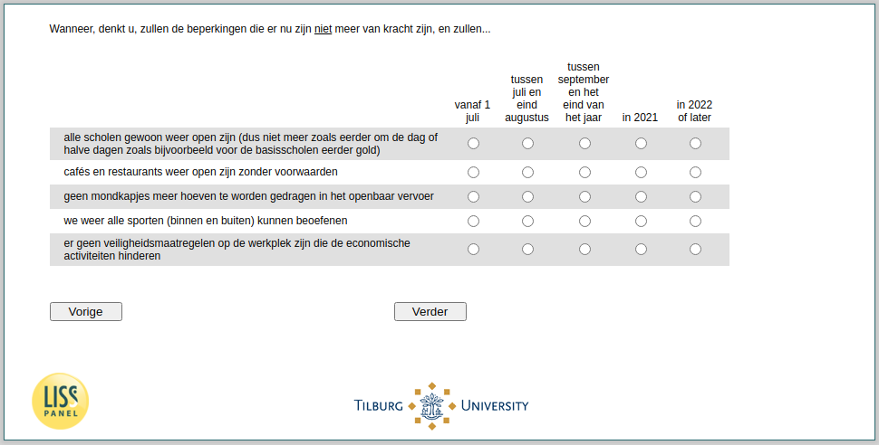

.. _w4e-duration: 

 
 .. role:: raw-html(raw) 
        :format: html 
 
`duration` – Expected Duration Restrictions
====================================================== 

:raw-html:`&larr;` :ref:`w4e-avoid` | :ref:`w4e-EmploymentStatus` :raw-html:`&rarr;` 
 

When do you think, the restrictions that are in place now will no longer be in force, and …
 
.. csv-table:: 
   :delim: | 
   :header: ,from July 1, between July and late August, between September and the end of the year, in 2021, in 2022 or later
 
           all schools are just open again (so no longer as before every other day or half days as before primary schools used to) | :raw-html:`&#10063;`|:raw-html:`&#10063;`|:raw-html:`&#10063;`|:raw-html:`&#10063;`|:raw-html:`&#10063;` 
           cafes and restaurants are open again unconditionally | :raw-html:`&#10063;`|:raw-html:`&#10063;`|:raw-html:`&#10063;`|:raw-html:`&#10063;`|:raw-html:`&#10063;` 
           No more masks need to be worn in public transport | :raw-html:`&#10063;`|:raw-html:`&#10063;`|:raw-html:`&#10063;`|:raw-html:`&#10063;`|:raw-html:`&#10063;` 
           We can practice all sports again (indoor and outdoor) | :raw-html:`&#10063;`|:raw-html:`&#10063;`|:raw-html:`&#10063;`|:raw-html:`&#10063;`|:raw-html:`&#10063;` 
           Which of the following best describes your situation? If more options are available, choose the main activity or job. | :raw-html:`&#10063;`|:raw-html:`&#10063;`|:raw-html:`&#10063;`|:raw-html:`&#10063;`|:raw-html:`&#10063;` 

:raw-html:`&larr;` :ref:`w4e-avoid` | :ref:`w4e-EmploymentStatus` :raw-html:`&rarr;` 
 
