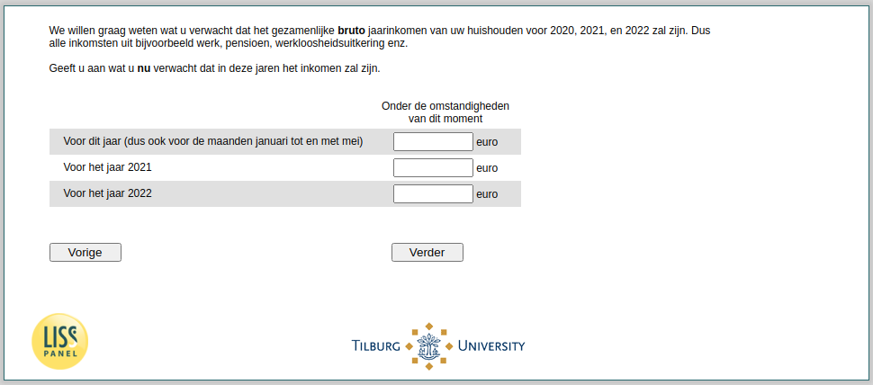

.. _w4e-expectedincome: 

 
 .. role:: raw-html(raw) 
        :format: html 
 
`expectedincome` – Expected Income
=================================================== 

:raw-html:`&larr;` :ref:`w4e-income` | :ref:`w4e-v0` :raw-html:`&rarr;` 
 

We want to know what you expect the combined gross annual income of your household for 2020, 2021 and 2022 will be. So all the income from work for example, pension, unemployment etc.

Gives you what you expect will be the income in those years.
 
.. csv-table:: 
   :delim: | 
   :header: ,Before the existence of an outbreak of coronavirus, Under the circumstances of the moment,
 
           For this year (including the month | :raw-html:`<form><input type="text" id="fname" name="fname"> </form>` |:raw-html:`<form><input type="text" id="fname" name="fname"> </form>` |:raw-html:`<form><input type="text" id="fname" name="fname"> </form>` 
           For the year 2021 | :raw-html:`<form><input type="text" id="fname" name="fname"> </form>` |:raw-html:`<form><input type="text" id="fname" name="fname"> </form>` |:raw-html:`<form><input type="text" id="fname" name="fname"> </form>` 
           For the year 2022 | :raw-html:`<form><input type="text" id="fname" name="fname"> </form>` |:raw-html:`<form><input type="text" id="fname" name="fname"> </form>` |:raw-html:`<form><input type="text" id="fname" name="fname"> </form>` 

:raw-html:`&larr;` :ref:`w4e-income` | :ref:`w4e-v0` :raw-html:`&rarr;` 
 
