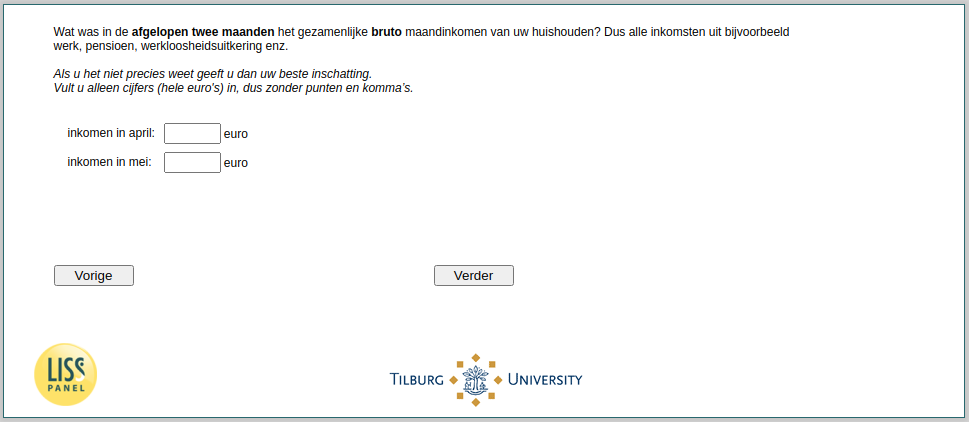

.. _w4e-income: 

 
 .. role:: raw-html(raw) 
        :format: html 
 
`income` – Income
========================== 

:raw-html:`←` :ref:`w4e-vakantiegeld3` | :ref:`w4e-expectedincome` :raw-html:`→` 
 

Once again: thank you in advance for participating!
 
.. csv-table:: 
   :delim: | 
 
           income in January: | :raw-html:`<form><input type="text" id="fname" name="fname"> </form>` 
           income in February: | :raw-html:`<form><input type="text" id="fname" name="fname"> </form>` 
           income in March: | :raw-html:`<form><input type="text" id="fname" name="fname"> </form>` 
           income in April: | :raw-html:`<form><input type="text" id="fname" name="fname"> </form>` 
           income in May: | :raw-html:`<form><input type="text" id="fname" name="fname"> </form>` 

:raw-html:`&larr;` :ref:`w4e-vakantiegeld3` | :ref:`w4e-expectedincome` :raw-html:`&rarr;` 
 
