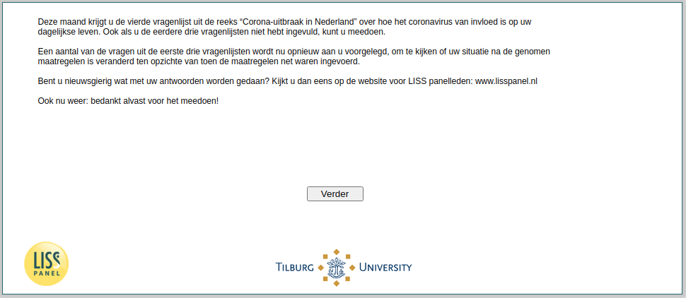

.. _w4e-intro: 

 
 .. role:: raw-html(raw) 
        :format: html 
 
`intro` – Introduction
============================== 

:ref:`w4e-q1header` :raw-html:`&rarr;` 
 

This month you will receive the fourth questionnaire from the series “Corona outbreak in the Netherlands” about how the coronavirus affects your daily life. You can also participate if you have not completed the previous three questionnaires.

Some of the questions in the first three questionnaires are now being put to you again to see if your situation has changed after the measures taken compared to when the measures were just introduced.

Are you curious about what will be done with your answers? Take a look at the website for LISS panel members: www.lisspanel.nl

Again: thanks in advance for participating!

 
 

:ref:`w4e-q1header` :raw-html:`&rarr;` 
 
