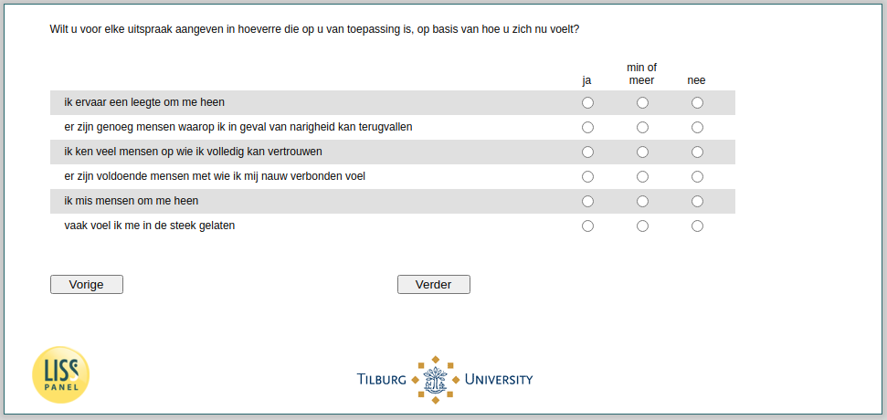

.. _w4e-loneliness: 

 
 .. role:: raw-html(raw) 
        :format: html 
 
`loneliness` – Loneliness
====================================== 

:raw-html:`&larr;` :ref:`w4e-q30hd_maand` | :ref:`w4e-soccont` :raw-html:`&rarr;` 
 

For each statement, please indicate to what extent it applies to you, based on how you feel now?
 
.. csv-table:: 
   :delim: | 
   :header: ,yes, more or less, no
 
           I feel an emptiness around me | :raw-html:`&#10063;`|:raw-html:`&#10063;`|:raw-html:`&#10063;` 
           there are plenty of people that I can fall back in case of trouble | :raw-html:`&#10063;`|:raw-html:`&#10063;`|:raw-html:`&#10063;` 
           I know many people I can trust completely | :raw-html:`&#10063;`|:raw-html:`&#10063;`|:raw-html:`&#10063;` 
           There are enough people I feel closely connected to me | :raw-html:`&#10063;`|:raw-html:`&#10063;`|:raw-html:`&#10063;` 
           I miss people around me | :raw-html:`&#10063;`|:raw-html:`&#10063;`|:raw-html:`&#10063;` 
           I often feel let me down | :raw-html:`&#10063;`|:raw-html:`&#10063;`|:raw-html:`&#10063;` 

:raw-html:`&larr;` :ref:`w4e-q30hd_maand` | :ref:`w4e-soccont` :raw-html:`&rarr;` 
 
