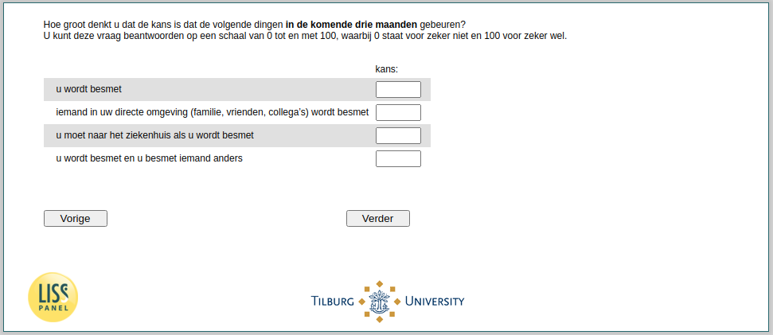

.. _w4e-q1header: 

 
 .. role:: raw-html(raw) 
        :format: html 
 
`q1header` – Subjective Risks
======================================== 

:raw-html:`&larr;` :ref:`w4e-intro` | :ref:`w4e-q30hd_maand` :raw-html:`&rarr;` 
 

How likely do you think the following things are likely to happen in the next three months? You can answer this question on a scale from 0 to 100, where 0 stands for certainly not and 100 stands for certainly.
 
.. csv-table:: 
   :delim: | 
 
           you are infected | :raw-html:`<form><input type="text" id="fname" name="fname"> </form>` 
           anyone in your immediate environment (family, friends, colleagues) is infected | :raw-html:`<form><input type="text" id="fname" name="fname"> </form>` 
           you should go to the hospital if you are infected | :raw-html:`<form><input type="text" id="fname" name="fname"> </form>` 
           you are infected and infected someone else | :raw-html:`<form><input type="text" id="fname" name="fname"> </form>` 

:raw-html:`&larr;` :ref:`w4e-intro` | :ref:`w4e-q30hd_maand` :raw-html:`&rarr;` 
 
