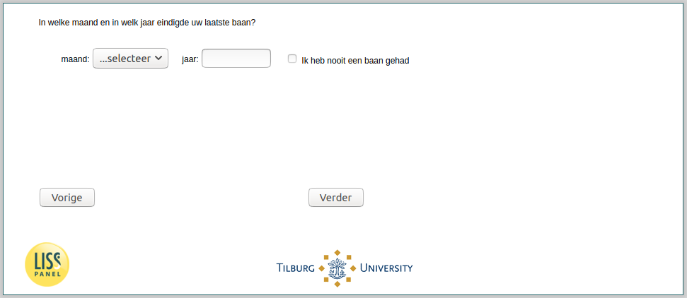

.. _w4e-q4_header: 

 
 .. role:: raw-html(raw) 
        :format: html 
 
`q4_header` – Last Job End
====================================== 

:raw-html:`←` :ref:`w4e-q2` | :ref:`w4e-beliefs1` :raw-html:`→` 
 

In which month and in which year did your last job end?
 
.. csv-table:: 
   :delim: | 
   :header: ,year, month
 
           nan | :raw-html:`<form><input type="text" id="fname" name="fname"> </form>` |:raw-html:`<form><input type="text" id="fname" name="fname"> </form>` 

:raw-html:`&larr;` :ref:`w4e-q2` | :ref:`w4e-beliefs1` :raw-html:`&rarr;` 
 
