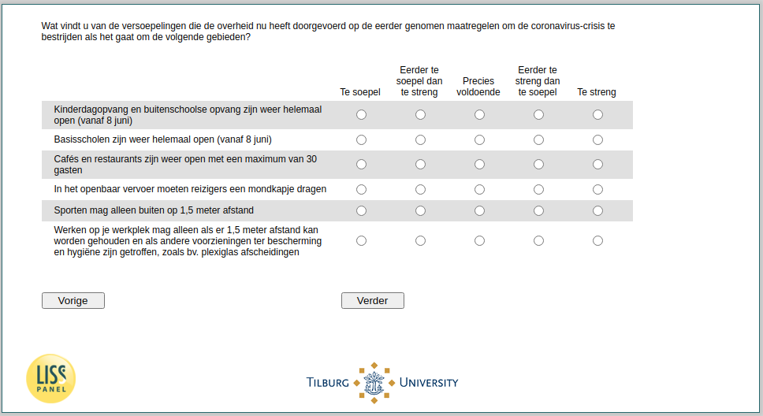

.. _w4e-support: 

 
 .. role:: raw-html(raw) 
        :format: html 
 
`support` – Support Government Policy
=============================================== 

:raw-html:`&larr;` :ref:`w4e-soccont` | :ref:`w4e-avoid` :raw-html:`&rarr;` 
 

What do you think of the easing that the government has now made to the measures previously taken to combat the coronavirus crisis in the following areas?
 
.. csv-table:: 
   :delim: | 
   :header: ,Too flexible, Rather too flexible than too strict, Just enough, Rather too strict than too flexible, Too strict
 
           Childcare and after-school care are open again (from 8 June) | :raw-html:`&#10063;`|:raw-html:`&#10063;`|:raw-html:`&#10063;`|:raw-html:`&#10063;`|:raw-html:`&#10063;` 
           Schools are open again (from 8 June) | :raw-html:`&#10063;`|:raw-html:`&#10063;`|:raw-html:`&#10063;`|:raw-html:`&#10063;`|:raw-html:`&#10063;` 
           Cafes and restaurants are open again with a maximum of 30 guests | :raw-html:`&#10063;`|:raw-html:`&#10063;`|:raw-html:`&#10063;`|:raw-html:`&#10063;`|:raw-html:`&#10063;` 
           In public transport passengers should wear a facemask | :raw-html:`&#10063;`|:raw-html:`&#10063;`|:raw-html:`&#10063;`|:raw-html:`&#10063;`|:raw-html:`&#10063;` 
           Sports may only outside at 1.5 meters away | :raw-html:`&#10063;`|:raw-html:`&#10063;`|:raw-html:`&#10063;`|:raw-html:`&#10063;`|:raw-html:`&#10063;` 
           Working at your workplace may only if 1.5 meters can be held and other provisions have been made for the protection and hygiene, eg. Plexiglas partitions | :raw-html:`&#10063;`|:raw-html:`&#10063;`|:raw-html:`&#10063;`|:raw-html:`&#10063;`|:raw-html:`&#10063;` 

:raw-html:`&larr;` :ref:`w4e-soccont` | :ref:`w4e-avoid` :raw-html:`&rarr;` 
 
