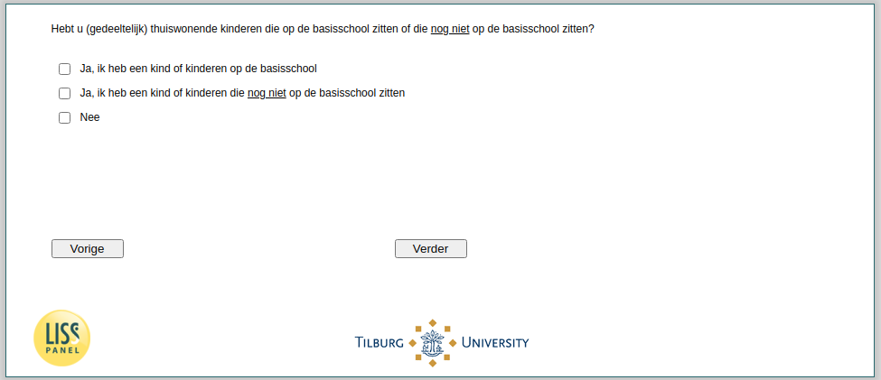

.. _w4e-v0: 

 
 .. role:: raw-html(raw) 
        :format: html 
 
`v0` – School Aged Children in Household
============================================= 

:raw-html:`&larr;` :ref:`w4e-expectedincome` | :ref:`w4e-v0a` :raw-html:`&rarr;` 
 

Do you have (partially) children living at home who are in primary school or who are not yet in primary school?
 
:raw-html:`&#10063;` – Yes, I have a child in elementary school
 
:raw-html:`&#10063;` – Yes, I have a child or children who are not yet in elementary school
 
:raw-html:`&#10063;` – Yes, I have a child or children who are not yet in elementary school
 

:raw-html:`&larr;` :ref:`w4e-expectedincome` | :ref:`w4e-v0a` :raw-html:`&rarr;` 
 
